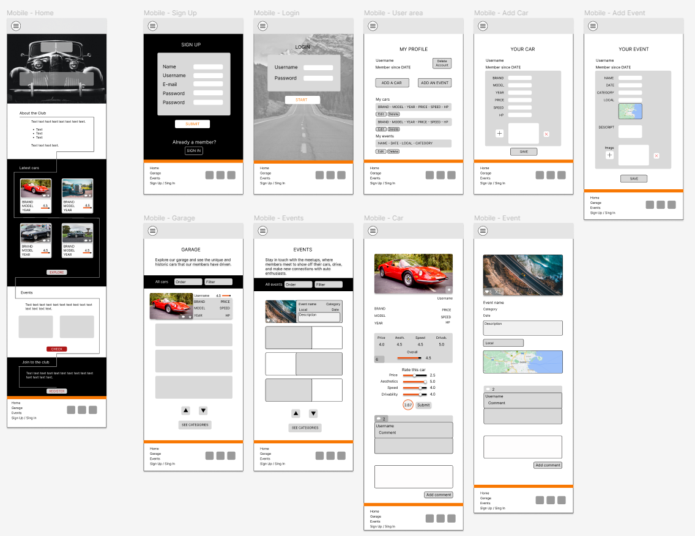

# Auto Classic

The Auto Classic is a website for people who are passionate about classic and vintage cars. Where users can share their vehicles and suggest events for car gatherings. 

To create a community of classic car owners and enthusiasts, to socialize, evaluate cars, give their opinion, and increase networking for future opportunities.

- Here is the link to the final project > [Auto Classic Club](https://auto-classic.herokuapp.com/)

## Contents

## UX/UI Design

### Strategy

#### Site owner goals

- The website targets those who are excited by classic and vintage cars. The project was designed to be a great community for everyone who likes the experience of drive, seeing, or understanding more about historic cars.
- The website is designed to be intuitive and easy to navigate.
- The website was designed to be responsive and to meet all screen sizes.
- The website should prioritize the display of the posts and present the content in a good way.

#### Agile

For the development of this project, the Agile methodology was applied. As a support tool, I used the GitHub projects.

- To visualize the project access this link > [Agile Auto Classic](https://github.com/guisgrande/fourth-project-ci/projects/1)

As you can see, we used a simple Kanban board with the fields (To do, Doing, Done). To do the next ones that will be executed, Doing the ones that are currently being developed and Done the ones that were finished.

The final structure after the elaboration was 5 different epics and a total of 26 User Stories distributed among them. In the following image, I detail the EPICs and their respective US.

    
Agile Structure

    

        
    

 

To run agile most efficiently, the following Sprints were determined as per the following image. The User Stories __#08 Recovery password__ and __#09 Edit username__ were not implemented in the project at this moment, being on stand by for future updates.

    
Agile Sprints

    

        
    

#### User stories

- As a user, I want to understand the content of the website, so I can know if it's of my interest.
- As a user, I want to easily navigate the site, so I can load the page with the content I want to access.
- As a user, I want to have access to all the links, so I can connect to the website's social networks.
- As a user, I want to create an account and login/logout, so I can interact with the website and community, access my account and close it on multiple devices.
- As a user, I want to add new posts, edit and delete them, so I can upload my content and manipulate it if necessary.
- As a user, I want to interact with the other posts, so I can give my opinion and interact with my favorites.

### Scope

For the scope of this project the following key points were determined.
- Create a webpage application using the Django framework.
- Use bootstrap to make the site responsive, and custom CSS and Java Script to complement.
- Allow the user to create an account in order to upload content.
- Allow logged in users to interact with other posts through comments and actions.
- Allow users to manipulate their content (CRUD Operations).
- The frontend should be simple and present the content in a clear way.
- The website should be functional, easy to navigate and intuitive.

### Structure

Auto Classic, will have five distinct pages for the first-time user.
- Home page, Garage (Cars), Events, Signup, and Signin.

Unlogged users will be able to navigate through these five pages and will be able to see the details of each Car or Event by clicking on its link. But they will not be able to interact.

When the user creates an account and is logged in, the following pages will be displayed.
- Home page, Garage (Cars), Events, Logout, Members.

Logged-in users will be able to access the site completely. Being able to access the details of the cars and events post and interact with them.

He will be able to access his area (Members) to add new posts, modify the ones already added, or delete them.

### Skeleton

#### Wireframes

The wireframe was created using the Figma tool. During the elaboration of the wireframes, I added what the front end should look like. At the end of the development some changes were made.

- To visualize full desktop wireframe project > [Figma - Auto Classic Desktop](https://www.figma.com/file/zKQz8GjUEB8L82Sxj5U5SQ/PP4?node-id=35%3A3)

    
Wireframes - Desktop

    

        
        
        
        
    

- To visualize full mobile wireframe project > [Figma - Auto Classic Mobile](https://www.figma.com/file/zKQz8GjUEB8L82Sxj5U5SQ/PP4?node-id=0%3A1)

    
Wireframes - Mobile

    

        
    

#### Database diagram

The base data for Auto Classic starts from the logged in user who can create a Car or Event post. 

The Car database relates to the RateCar and CommentCar database. And the Event database relates to the CommentEvent database.

    
Diagram

    

        
    

### Surface

#### Colour scheme

The colors chosen to compose the website are the following.

- The colors white/black will be used for the background and to create contrast between the sections.
- The gray will be used in the forms and cards to stand out from the background.
- Orange will be used to highlight the nav bar/footer/buttons.
- Yellow will be used for title effects, and view more button.

- Bootstrap default colors were also used for some buttons on the forms.

    
Colour scheme

    
    

        
    

#### Typography

The site's font was chosen from google fonts. I chose the Quicksand (Light 300) font. It was used throughout the entire site, including titles and body. The only element with a different font is the custom banner.

#### Imagery

- For the auto classic project, I selected images that can enhance the user's visual response and convey the idea of the website. the images were selected from unsplash (credit mentioned in the readme).
- The first image of the front of a classic car in black and white that was used as a hero image on the home page.
- I selected two default images (placeholders) that are loaded in case the user doesn't add any image in the car or event post, one image for each respectively.

## Features

### Existing Features

### Features Left to Implement

## Testing
    
### Fixed Bugs

### Unfixed Bugs 
    
## Deployment

### Deployment

### Fork

### Clone

## Technologies and tools

- [Gitpod](https://www.gitpod.io/) - to create/edit the code of the project.
- [Github](https://github.com/) - to create repository, hosting files and deployment of the website.

## Credits

### Content

### Media

### Inspiration

## Acknowledgements
