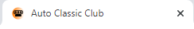
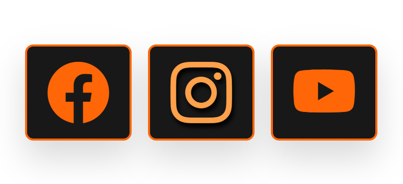
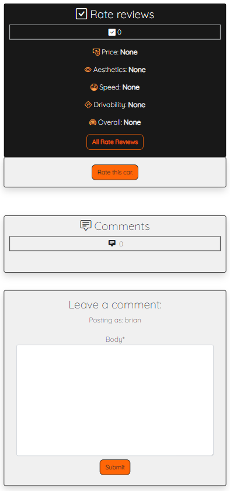
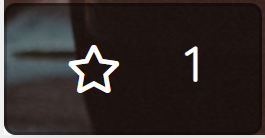
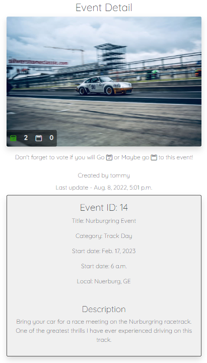
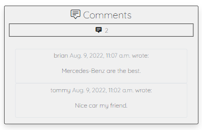
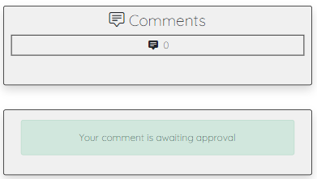

# Auto Classic

The Auto Classic is a website for people who are passionate about classic and vintage cars. Where users can share their vehicles and suggest events for car gatherings. 

To create a community of classic car owners and enthusiasts, to socialize, evaluate cars, give their opinion, and increase networking for future opportunities.

- Here is the link to the final project > [Auto Classic Club](https://auto-classic.herokuapp.com/)

<div align="center">
    
</div>

## Contents

## UX/UI Design

### Strategy

#### Site owner goals

- The website targets those who are excited by classic and vintage cars. The project was designed to be a great community for everyone who likes the experience of drive, seeing, or understanding more about historic cars.
- The website is designed to be intuitive and easy to navigate.
- The website was designed to be responsive and to meet all screen sizes.
- The website should prioritize the display of the posts and present the content in a good way.

#### Agile

For the development of this project, the Agile methodology was applied. As a support tool, I used the GitHub projects.

- To visualize the project access this link > [Agile Auto Classic](https://github.com/guisgrande/fourth-project-ci/projects/1)

As you can see, we used a simple Kanban board with the fields (To do, Doing, Done). To do the next ones that will be executed, Doing the ones that are currently being developed and Done the ones that were finished.

The final structure after the elaboration was 5 different epics and a total of 26 User Stories distributed among them. In the following image, I detail the EPICs and their respective US.

<details>
    <summary>Agile Structure</summary>
    <div align="center">
        
    </div>
</details> 

To run agile most efficiently, the following Sprints were determined as per the following image. The User Stories __#08 Recovery password__ and __#09 Edit username__ were not implemented in the project at this moment, being on stand by for future updates.

<details>
    <summary>Agile Sprints</summary>
    <div align="center">
        
    </div>
</details>

#### User stories

- As a user, I want to understand the content of the website, so I can know if it's of my interest.
- As a user, I want to easily navigate the site, so I can load the page with the content I want to access.
- As a user, I want to have access to all the links, so I can connect to the website's social networks.
- As a user, I want to create an account and login/logout, so I can interact with the website and community, access my account and close it on multiple devices.
- As a user, I want to add new posts, edit and delete them, so I can upload my content and manipulate it if necessary.
- As a user, I want to interact with the other posts, so I can give my opinion and interact with my favorites.

### Scope

For the scope of this project the following key points were determined.
- Create a webpage application using the Django framework.
- Use bootstrap to make the site responsive, and custom CSS and Java Script to complement.
- Allow the user to create an account in order to upload content.
- Allow logged in users to interact with other posts through comments and actions.
- Allow users to manipulate their content (CRUD Operations).
- The frontend should be simple and present the content in a clear way.
- The website should be functional, easy to navigate and intuitive.

### Structure

Auto Classic, will have five distinct pages for the first-time user.
- Home page, Garage (Cars), Events, Signup, and Signin.

Unlogged users will be able to navigate through these five pages and will be able to see the details of each Car or Event by clicking on its link. But they will not be able to interact.

When the user creates an account and is logged in, the following pages will be displayed.
- Home page, Garage (Cars), Events, Logout, Members.

Logged-in users will be able to access the site completely. Being able to access the details of the cars and events post and interact with them.

He will be able to access his area (Members) to add new posts, modify the ones already added, or delete them.

### Skeleton

#### Wireframes

The wireframe was created using the Figma tool. During the elaboration of the wireframes, I added what the front end should look like. At the end of the development some changes were made.

- To visualize full desktop wireframe project > [Figma - Auto Classic Desktop](https://www.figma.com/file/zKQz8GjUEB8L82Sxj5U5SQ/PP4?node-id=35%3A3)

<details>
    <summary>Wireframes - Desktop</summary>
    <div align="center">
        
        
        
        
    </div>
</details>

- To visualize full mobile wireframe project > [Figma - Auto Classic Mobile](https://www.figma.com/file/zKQz8GjUEB8L82Sxj5U5SQ/PP4?node-id=0%3A1)

<details>
    <summary>Wireframes - Mobile</summary>
    <div align="center">
        
    </div>
</details>

#### Database diagram

The base data for Auto Classic starts from the logged in user who can create a Car or Event post. 

The Car database relates to the RateCar and CommentCar database. And the Event database relates to the CommentEvent database.

<details>
    <summary>Diagram</summary>
    <div align="center">
        
    </div>
</details>

### Surface

#### Colour scheme

The colors chosen to compose the website are the following.

- The colors white/black will be used for the background and to create contrast between the sections.
- The gray will be used in the forms and cards to stand out from the background.
- Orange will be used to highlight the nav bar/footer/buttons.
- Yellow will be used for title effects, and view more button.

- Bootstrap default colors were also used for some buttons on the forms.

<details>
    <summary>Colour scheme</summary>
    <div align="center">
        
    </div>
</details>

#### Typography

The site's font was chosen from google fonts. I chose the Quicksand (Light 300) font. It was used throughout the entire site, including titles and body. The only element with a different font is the custom banner.

#### Imagery

- For the auto classic project, I selected images that can enhance the user's visual response and convey the idea of the website. the images were selected from unsplash (credit mentioned in the readme).
- The first image of the front of a classic car in black and white that was used as a hero image on the home page.
- I selected two default images (placeholders) that are loaded in case the user doesn't add any image in the car or event post, one image for each respectively.

## Features

### Existing Features

#### __Favicon__

- Favicon is loaded on every page, the little logo is also present in the site banner.

<div align="center">
    
</div>

#### __Navbar__

- Navbar that is present on all pages for user navigation through the website, is present the logo/banner with the site name that redirects to the home page,
the link to home page, a link to garage (all cars), a link to events (all events), the next two links alternate if the user is logged in or not.
- If the user does not have an account or is logged out, links to signup (register a new account) and signin (for the user to log in) are available.
user is logged in, the links are available to logout (confirmation page) and link to members (user area). 
to orange, giving a highlight to which page he will be redirected with the click.

<div align="center">
    
    
    
</div>

- Navbar is responsive, for mobiles it automatically groups to drowdown menu.

<div align="center">
    
</div>
<div align="center">
    
</div>

#### __Footer__

- The footer is shown only when reaching the end of the page, it counts with a list with the links that are present in the navbar with the same change in case the user is logged in or not. 
- Is also present three links that redirect the users to the social networks of the page to increase their interaction with the community.

<div align="center">
    
</div>
<div align="center">
    
</div>

- The links present in the footer count with hover effect to increase the highlight of which selection will be executed with the click.

<div align="center">
    
    
</div>

#### __Hero image__

- Present on the index page, and one of the first images that the user sees when he logs into the website, it has a background image of an old car and with the name of the site and a brief description of the site's purpose.

<div align="center">
    
</div>

#### __About section__

- This section has a short introductory text about what is being made available on the website.

<div align="center">
    
</div>

#### __Latest cars__

- Has a card display of the last four cars added to the site, for users to get an idea of what the content is like. Each car has a button to see more details.
- At the end of this section, a button to explore all cars, with hover effect.

<div align="center">
    
</div>

#### __Latest events__

- Counts with the card exhibition of the last events added in the site, for the users to visualize how the events are. Each event has a button to see more details.
- At the end of this section, a button to explore all events, with hover effect.

<div align="center">
    
</div>

#### __Join the club__

- The last section of the index page is a text calling the user to action and a button to create an account. In case he is a recurrent user that already has an account and is logged in this text is changed to a greeting and a button (hover effect) to redirect to the memeber area.

<div align="center">
    
    
</div>

#### __Sign up__

- Registration page, with a simple form with the field for username, e-mail (optional) and for password twice, a button to register. A short text that calls who already has a registration to the login page.

<div align="center">
    
</div>

#### __Sign in__

- Access page, with two fields to be filled in (username and password). a button to log in. A short text with a callout for those who don't have an account.

<div align="center">
    
</div>

#### __Logout__

- Page for logged in users who have selected the logout option, it asks if they really want to perform this action.

<div align="center">
    
</div>

#### __User area__

- Area for logged in users, display greeting text with user name, four buttons for action: add car, add event, view cars, view events. At the end of the page has the setting account, with option to delete the account.

<div align="center">
    
</div>

- If the user tries to access the page with the url without being logged in, it shows a different screen saying that he must create an account or log in to his existing account.

<div align="center">
    
</div>

#### __My cars__

- Page for logged in users that shows a list of the cars added by the user. Each car has three action options: view more (car info), edit (to edit car information) and delete (to delete car).

<div align="center">
    
</div>

#### __My events__

- Page for logged in users that shows a list of the cars added by the user. Each event has three action options: view more (event info), edit (to edit event information) and delete (to delete event)

<div align="center">
    
</div>

#### __Delete account__

- Area for the user to confirm that he really wants to delete the account. Rephrase the question informing that all data will be deleted when confirming. 
- A button to cancel and a link back to the member area.

<div align="center">
    
</div>

#### __Add car__

- Page for logged in users that provides the form for adding a new car.

<div align="center">
    
</div>

#### __Edit car__

- Page for logged in users that allows editing of a previously added car, only the user himself can change it. The same page as the add car, but the information is already filled in as it was added and can be modified.

<div align="center">
    
</div>

#### __Delete car__

- A page for logged in users that enables them to delete information about their added car, shows a summary of the car's information and a question confirming if they want to continue with the action, which is irreversible.

<div align="center">
    
</div>

#### __Add event__

- Page for logged in users that provides the form for adding a new event.

<div align="center">
    
</div>

#### __Edit event__

- Page for logged in users that allows editing of a previously added event, only the user himself can change it. The same page as the add event, but the information is already filled in as it was added and can be modified.

<div align="center">
    
</div>

#### __Delete event__

- Page for logged in users that enables them to delete the information of their added event, shows the summarized event information and a question confirming if they want to continue with the action that is irreversible.

<div align="center">
    
</div>

#### __Garage page__

- Page shows all cars added in the website, by default shows the most recent first. has a search field, a field to sort the list according to the available option.
- Each car is visible in a card with the following information (picture, brand, model, year, username, number of favourites and a button to more details).

<div align="center">
    
</div>

- By default the page loads only the last 6 cars, but the load more button loads 3 more posts with each click. Until there are no more and it changes to "no more cars".

<div align="center">
    
</div>

#### __Car info__

- Page with all car informations in more details, and the following sections: favorite, rate review, comment. these sections are presented in different ways for logged in and non logged in users.
- Not logged in user can only see the total of favorites and can not interact, can only see the total of reviews and the score and can not evaluate, can only read the comments and can not comment.
- Logged in user can see everything that the non logged in user can see, but he can interact with the page, by favoriting or un-favoriting a car, he can rate a car (only once per car), and he can send comments.

<div align="center">
    
    
</div>

- Favourite button

<div align="center">
    
    
</div>

#### __Rate car__

- Shows the average points and a button to show all reviews. Next to it a button is displayed for logged in users if they haven't voted and a message if they have already voted on the car. 

<div align="center">
    
    
</div>

- If the user is not logged in. Message that is displayed.

<div align="center">
    
</div>

- Rate form and confirmation

<div align="center">
    
    
</div>

#### __Events page__

- Page shows all events added in the website, by default shows the most recent first. it has a search field, a field to sort the list according to the available option.
- Each event is visible in a card with the following information (image, title, category, date, location, number of go/maybe, a button to more details).
    
<div align="center">
    
</div>

- By default the page loads only the last 6 events, but the load more button loads 3 more posts with each click. Until there are no more and it changes to "no more events".

<div align="center">
    
</div>

- Presence vote buttons

<div align="center">
    
    
    
</div>

#### __Event info__

- Page with all event informations in more details, and the following sections: go or maybe go and comment. these sections are presented in different ways for logged in and not logged in users.
- Not logged in user can only see the total go or maybe go and can't interact, can only read the comments and can't comment.
- Logged in user can see everything that the non logged in user can see, but he can interact with the page, selecting go or maybe go to an event, and can send comments.

<div align="center">
    
    
</div>

#### __Comments__

- The comments have the same layout for cars and events. Only logged in users can comment. A message that the comment has been sent for approval will appear as soon as you submit the comment.

<div align="center">
    
    
</div>

#### __Custom error pages__

- If any of the following errors occur (Error 400, 403, 404 or 500) a custom page will be displayed that will show text specifying the reason for the error and a link back to the home page. All pages have the same layout, only the explanatory text changes.

<div align="center">
    
    
</div>

### Features Left to Implement

- A section for service providers, such as repair, parts, washing, mechanic, insurance and others, where they can offer their services with better conditions for website users.
- The possibility for users to send private messages to other users, so they can make offers or communicate in a more practical way than comments.
- Add more functionalities in the user area like interaction notifications, more information options like profile (photo, description, interests).

## Testing
    
### Fixed Bugs

### Unfixed Bugs 
    
## Deployment

- To create this project I used GitHub and GitPod.
- I used the [Code Institute Gitpod Full Template](https://github.com/Code-Institute-Org/gitpod-full-template), clicking on the "Use this template" button. From there I created the repository on Github with my username.
- These commands were used for version control during project:
    * git status - to check the status of the files to be commited.
    * git add filename - to add files before committing.
    * git commit -m "message" - to commit changes to the local repository.
    * git push - to push all committed changes to the GitHub repository.

### Deployment

1. Create Django project and app

    - I installed django using the command `pip3 install 'django<4' gunicorn`;
    - I installed supporting database libraries dj_database_url and psycopg2, using `pip3 install dj_database_url psycopg2`;
    - I installed Cloudinary library to upload the images, using `pip3 install dj3-cloudinary-storage`;
    - I created the requirements.txt file using the command `pip3 freeze --local > requirements.txt`;
    - I created my Django project with the command `django-admin startproject project_name .`;
    - I created my Django app with the command `python3 manage.py startapp app_name`;
    - I used the comands `python3 manage.py makemigrations` and `python3 manage.py migrate`;
    - To test and run the project I used `python3 manage.py runserver`.

2. Create Heroku app

    - I opened the heroku website and logged into my account
    - I created a new app with the project name, chose the region Europe
    - I opened the Resources section and searched for Heroku Postgres and selected it
    - I opened the Settings section and then Config VARS, after I initially added the keys needed to start development `DATABASE_URL`/`SECRET_KEY`/`CLOUDINARY_URL`;
    - Still in Config VARS I added the following keys: `PORT` with a value of `8000` and `DISABLE_COLLECTSTATIC` with a value of `1`;

3. Set up Django settings.py and necessary folders/files

    - Set up to connect the environment variables
    ```
    from pathlib import Path
    import os
    import dj_database_url
    from django.contrib.messages import constants as messages
    if os.path.isfile('env.py'):
        import env
    ```
    - Inside `INSTALLED_APPS` I added the necessary apps
    
    - For the database I replaced it with the following code
    ```
    DATABASES = {
    'default': dj_database_url.parse(os.environ.get('DATABASE_URL'))
    }
    ```
    
    - For the static files I replaced it with the following code to conect to Cloudinary
    ```
    STATIC_URL = '/static/'
    STATICFILES_STORAGE = 'cloudinary_storage.storage.StaticHashedCloudinaryStorage'
    STATICFILES_DIRS = [os.path.join(BASE_DIR, 'static')]
    STATIC_ROOT = os.path.join(BASE_DIR, 'staticfiles')

    MEDIA_URL = '/media/'
    DEFAULT_FILE_STORAGE = 'cloudinary_storage.storage.MediaCloudinaryStorage'
    ```
    - Create a Procfile and add the following text
    ```
    web: gunicorn autoclassic.wsgi
    ```
    
4. Final deployment.

    - In `settings.py` inside the Django project I changed `DEBUG = False`;
    - Also in the settings.py file I added `X_FRAME_OPTIONS = "SAMEORIGIN"`;
    - In Heroku I went back to Settings > Config VARS and removed the `DISABLE_COLLECTSTATIC` var;
    - In Heroku I navigated to the Deploy section;
    - I clicked to connect to GitHub and searched for my repository for this project;
    - I clicked on manual deploy to build the App;
    - When finished, I clicked the View button, which redirected me to the live site.

### Fork

- Forks let you make changes to a project without affecting the original repository. Follow this steps:
1. Go to the repository page, can be accessed [here](https://github.com/guisgrande/fourth-project-ci).
2. On top right, you select the Fork option and proceed.
3. A duplicate will be created inside your repository.

### Clone

- Clone let you create an identical repository to the original. Follow this steps:
1. Go to the repository page, can be accessed [here](https://github.com/guisgrande/fourth-project-ci).
2. Click on code drop down menu.
3. Choose if you want to clone using HTTPS, SSH or GitHub CLI. Then select de copy button.
4. Open your Git Bash in your IDE.
5. Type git clone and then paste the URL you copied before.
6. Press Enter to create your clone.

## Technologies and tools

- Programming languages used: Python 3.6, Java Script, HTML5 and CSS3.

- [Gitpod](https://www.gitpod.io/) - Used to create/edit the code of the project.
- [Github](https://github.com/) - Used to create repository, for version control and Agile project.
- [Heroku](https://heroku.com/) -  Used to deploy the project.

- [Django](https://www.djangoproject.com/) -  Used in the development of this project. Main python Framework.
    - The following python modules were used on this project:
    ```
    asgiref==3.5.2
    cloudinary==1.29.0
    dj-database-url==0.5.0
    dj3-cloudinary-storage==0.0.6
    Django==3.2.14
    django-allauth==0.51.0
    django-crispy-forms==1.14.0
    django-summernote==0.8.20.0
    gunicorn==20.1.0
    oauthlib==3.2.0
    psycopg2==2.9.3
    PyJWT==2.4.0
    python3-openid==3.2.0
    pytz==2022.1
    requests-oauthlib==1.3.1
    sqlparse==0.4.2
    ```

- [Bootstrap](https://getbootstrap.com/) - Used to . CSS/JS Framework for developing responsiveness and styling.
- [PostgreSQL](https://www.postgresql.org/) - Used as database for this project. Straight from Heroku.
- [Cloudinary](https://cloudinary.com/) - Used to upload images and cloud hosting service.
- [Jquery Ajax](https://api.jquery.com/jquery.ajax/) - Used to load more content at garage and events pages.

- [Ludichart](https://www.lucidchart.com/) - Used to create the database diagram and agile images.
- [Figma](https://figma.com/) - Used to creat the wireframes.
- [Coolors](https://coolors.co/) - Used to choice of colors and for the palette used in the README.
- [Google Fonts](https://fonts.google.com/) - Used for font selection.
- [Font Awesome](https://fontawesome.com/) - Used for the favourite icon.
- [Bootstrap Icons](https://icons.getbootstrap.com/) - Used for all others icons.
- [Favicon.io](https://favicon.io/) - Used to implement the favicon on the website.

- [DevTools - Chrome](https://developer.chrome.com/docs/devtools/) - to assist in the development of the project.
- Lighthouse (Chrome Devtools) - Used to performance test.
- [WAVE](https://wave.webaim.org/) - Used to acecessibility test.

- [PEP8](http://pep8online.com/) - Used to test/validate Python code.
- [JShint](https://jshint.com/) - Used to test Java Script code.
- [Jigsaw](https://jigsaw.w3.org/css-validator/) - Used to test CSS code.
- [Validator](https://validator.w3.org/) - Used to test HTML code.

## Credits

### Code

Here are the information sources I used to finish the project and develop the necessary applications for it to work well.
- [Code Institute](https://codeinstitute.net/ie/).
    - First of all thank you for the instructions provided in the Code Institue course and classes, which were essential from start to finish.
- [Django Documentation](https://docs.djangoproject.com/en/4.1/).
    - That helped me to solve doubts about Django and the framework's features.
- [Bootstrap Documentation](https://getbootstrap.com/docs/5.2/getting-started/introduction/).
    - Served as a guide to better apply the functionalities of this great framework.

Some tutorials and codes I used in my project
- [Youtube 01 - Code Artisan Lab](https://www.youtube.com/watch?v=QVRm4_njFIQ&t=4s).
    - __Load more pagination with jQuery ajax | Django eCommerce Website | Django Tutorials__ - This video helped me implement the "load more" functionality in `garage.html` and `events.html`. The code was essential for this application, and some adjustments were made for my specific project.

- [Youtube 02 - Codemy.com](https://www.youtube.com/watch?v=AGtae4L5BbI&t=378s).
    - __Create A Search Bar - Django Wednesdays #9__ - This video helped me implement the "search bar" functionality in `garage.html` and `events.html`. The code was essential for this application, and some adjustments were made for my specific project.

- [Stack Overflow 01](https://stackoverflow.com/questions/979975/get-the-values-from-the-get-parameters-javascript).
- [Stack Overflow 02 PT](https://pt.stackoverflow.com/questions/76394/como-fa%C3%A7o-para-pegar-url-atual-em-javascript).
    - Helped me selecting content present in the url, used send sort data to Ajax loadmore function. On pages `garage.html` and `events.html`.

- [Stack Overflow 03](https://stackoverflow.com/questions/67571260/how-to-use-auto-generated-slug-as-post-url-link-in-django).
    - Helped me to code a funtion to autosave the slug when the user save any post or update them. On files `garage/models.py` and `events/models.py`.

- [Reddit 01](https://stackoverflow.com/questions/67571260/how-to-use-auto-generated-slug-as-post-url-link-in-django).
    - Helped me to code a funtion that allows the user to delete his account. On file `members/views.py`.

### Content

- [Unsplash](https://unsplash.com/).
    - All images used to create the demo content for the site were all selected from the Unsplash site. Both the images used in the car posts and in the events. I thank the professionals who provided the images and for the excellent work.

### Media

- The photos used for Hero (Home page) and placeholder images was taken from [Unsplash](https://unsplash.com/).
- The image used for README.md responsive mockup was taken from [Techsini](https://techsini.com/multi-mockup/index.php).
- The favicon, Auto Classic banner logo and image used at erro pages were taken from [Canva](https://www.canva.com/)

## Acknowledgements

- Code Institute for all the support and the team always ready to help.
- My mentor [Ben Kavanagh](https://github.com/BAK2K3) for all the instructions, advice and knowledge that helped me to improve the project.
- My parents, my wife and my friends for motivating me to achieve my best.
- Everyone in the Slack community for tips and opinions. 
