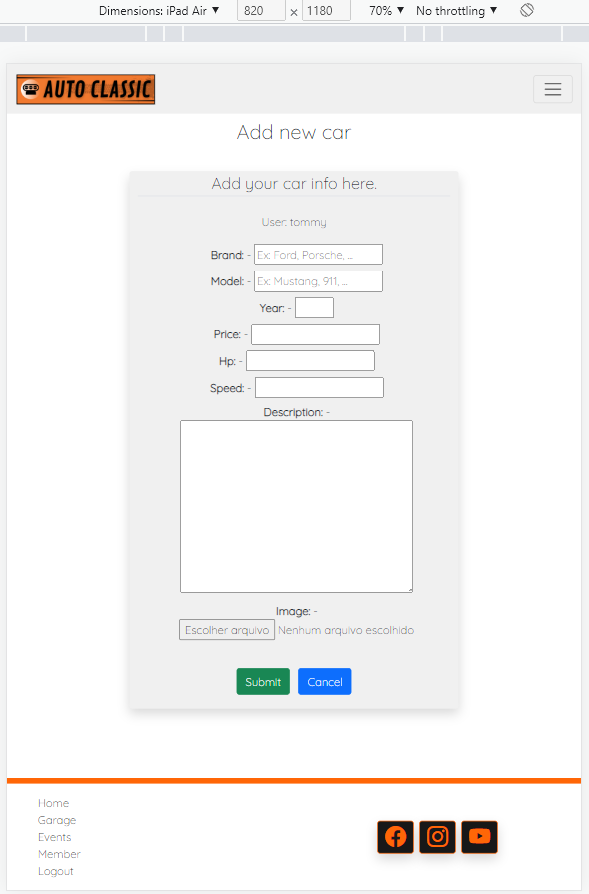

# Auto Classic - Testing

## Validation

Here is a report of the validations made on the code and their results

- __HTML__

List of pages validated by the tool [W3C Markup Validator](https://validator.w3.org/)

|   Page    |   URL  |  Result |  Link |
|    ---    |   ---  |   ---   |  ---  |
|    Home    | `https://auto-classic.herokuapp.com/` |   No errors   |  [Validated](https://validator.w3.org/nu/?doc=https%3A%2F%2Fauto-classic.herokuapp.com%2F)  |
|    Garage    | `https://auto-classic.herokuapp.com/garage/` |   No errors   |  [Validated](https://validator.w3.org/nu/?doc=https%3A%2F%2Fauto-classic.herokuapp.com%2Fgarage%2F)  |
|    Events    | `https://auto-classic.herokuapp.com/events/` |   No errors   |  [Validated](https://validator.w3.org/nu/?doc=https%3A%2F%2Fauto-classic.herokuapp.com%2Fevents%2F)  |
|    Signup    | `https://auto-classic.herokuapp.com/accounts/signup/` |   No errors   |  [Validated](https://validator.w3.org/nu/?doc=https%3A%2F%2Fauto-classic.herokuapp.com%2Faccounts%2Fsignup%2F)  |
|    Signin    | `https://auto-classic.herokuapp.com/accounts/login/` |   No errors   |  [Validated](https://validator.w3.org/nu/?doc=https%3A%2F%2Fauto-classic.herokuapp.com%2Faccounts%2Flogin%2F)  |
|    Logout    | `https://auto-classic.herokuapp.com/accounts/logout/` |   No errors   |  [Validated](https://validator.w3.org/nu/?doc=https%3A%2F%2Fauto-classic.herokuapp.com%2Faccounts%2Flogout%2F)  |
|    Member    | `https://auto-classic.herokuapp.com/members/` |   No errors   |  [Validated](https://validator.w3.org/nu/?doc=https%3A%2F%2Fauto-classic.herokuapp.com%2Fmembers%2F)  |
|    Delete Account    | `https://auto-classic.herokuapp.com/delete/` |   No errors   |  [Validated](https://validator.w3.org/nu/?doc=https%3A%2F%2Fauto-classic.herokuapp.com%2Fdelete%2F)  |
|    Member car list    | `https://auto-classic.herokuapp.com/membercars/` |   No errors   |  [Validated](https://validator.w3.org/nu/?doc=https%3A%2F%2Fauto-classic.herokuapp.com%2Fmembercars%2F)  |
|    Member event list    | `https://auto-classic.herokuapp.com/memberevents/` |   No errors   |  [Validated](https://validator.w3.org/nu/?doc=https%3A%2F%2Fauto-classic.herokuapp.com%2Fmemberevents%2F)  |
|    Add car    | `https://auto-classic.herokuapp.com/add-car/` |   No errors   |  [Validated](https://validator.w3.org/nu/?doc=https%3A%2F%2Fauto-classic.herokuapp.com%2Fadd-car%2F)  |
|    Add event    | `https://auto-classic.herokuapp.com/add-event/` |   No errors   |  [Validated](https://validator.w3.org/nu/?doc=https%3A%2F%2Fauto-classic.herokuapp.com%2Fadd-event%2F)  |
|    Edit car    | `https://auto-classic.herokuapp.com/edit-car/porsche-911-1988/` |   No errors   |  [Validated](https://validator.w3.org/nu/?doc=https%3A%2F%2Fauto-classic.herokuapp.com%2Fedit-car%2Fporsche-911-1988%2F)  |
|    Edit event    | `https://auto-classic.herokuapp.com/edit-event/road-trip-cork-to-galway/` |   No errors   |  [Validated](https://validator.w3.org/nu/?doc=https%3A%2F%2Fauto-classic.herokuapp.com%2Fedit-event%2Froad-trip-cork-to-galway%2F)  |
|    Delete car    | `https://auto-classic.herokuapp.com/delete-car/porsche-911-1988/` |   No errors   |  [Validated](https://validator.w3.org/nu/?doc=https%3A%2F%2Fauto-classic.herokuapp.com%2Fdelete-car%2Fporsche-911-1988%2F)  |
|    Delete event    | `https://auto-classic.herokuapp.com/delete-event/sale-and-trade-cars/` |   No errors   |  [Validated](https://validator.w3.org/nu/?doc=https%3A%2F%2Fauto-classic.herokuapp.com%2Fdelete-event%2Fsale-and-trade-cars%2F)  |
|    Car details    | `https://auto-classic.herokuapp.com/car-detail/chevrolet-chevelle-ss-454-1970/` |   No errors   |  [Validated](https://validator.w3.org/nu/?doc=https%3A%2F%2Fauto-classic.herokuapp.com%2Fcar-detail%2Fchevrolet-chevelle-ss-454-1970%2F)  |
|    Event details    | `https://auto-classic.herokuapp.com/event-detail/exposition-of-old-cars/` |   No errors   |  [Validated](https://validator.w3.org/nu/?doc=https%3A%2F%2Fauto-classic.herokuapp.com%2Fevent-detail%2Fexposition-of-old-cars%2F)  |
|    Rate car    | `https://auto-classic.herokuapp.com/rate-car/bugatti-eb110-gt-1993/` |   No errors   |  [Validated](https://validator.w3.org/nu/?doc=https%3A%2F%2Fauto-classic.herokuapp.com%2Frate-car%2Fbugatti-eb110-gt-1993%2F)  |

- __CSS__

List of pages validated an Unique CSS file validated by the tool [W3C Jigsaw Validator](https://jigsaw.w3.org/css-validator/)

File `/static/css/style.css` result in no error, just one alert with the following text: `-webkit-backdrop-filter is a vendor extension`

|   Page    |   URL  |  Result |  Link |
|    ---    |   ---  |   ---   |  ---  |
|    Home    | `https://auto-classic.herokuapp.com/` |   No errors   |  [Validated](https://jigsaw.w3.org/css-validator/validator?uri=https%3A%2F%2Fauto-classic.herokuapp.com%2F&profile=css3svg&usermedium=all&warning=1&vextwarning=&lang=en)  |
|    Garage    | `https://auto-classic.herokuapp.com/garage/` |   No errors   |  [Validated](https://jigsaw.w3.org/css-validator/validator?uri=https%3A%2F%2Fauto-classic.herokuapp.com%2Fgarage%2F&profile=css3svg&usermedium=all&warning=1&vextwarning=&lang=en)  |
|    Events    | `https://auto-classic.herokuapp.com/events/` |   No errors   |  [Validated](https://jigsaw.w3.org/css-validator/validator?uri=https%3A%2F%2Fauto-classic.herokuapp.com%2Fevents%2F&profile=css3svg&usermedium=all&warning=1&vextwarning=&lang=en)  |
|    Signup    | `https://auto-classic.herokuapp.com/accounts/signup/` |   No errors   |  [Validated](https://jigsaw.w3.org/css-validator/validator?uri=https%3A%2F%2Fauto-classic.herokuapp.com%2Faccounts%2Fsignup%2F&profile=css3svg&usermedium=all&warning=1&vextwarning=&lang=en)  |
|    Signin    | `https://auto-classic.herokuapp.com/accounts/login/` |   No errors   |  [Validated](https://jigsaw.w3.org/css-validator/validator?uri=https%3A%2F%2Fauto-classic.herokuapp.com%2Faccounts%2Flogin%2F&profile=css3svg&usermedium=all&warning=1&vextwarning=&lang=en)  |
|    Logout    | `https://auto-classic.herokuapp.com/accounts/logout/` |   No errors   |  [Validated](https://jigsaw.w3.org/css-validator/validator?uri=https%3A%2F%2Fauto-classic.herokuapp.com%2Faccounts%2Flogout%2F&profile=css3svg&usermedium=all&warning=1&vextwarning=&lang=en)  |
|    Member    | `https://auto-classic.herokuapp.com/members/` |   No errors   |  [Validated](https://jigsaw.w3.org/css-validator/validator?uri=https%3A%2F%2Fauto-classic.herokuapp.com%2Fmembers%2F&profile=css3svg&usermedium=all&warning=1&vextwarning=&lang=en)  |
|    Delete Account    | `https://auto-classic.herokuapp.com/delete/` |   No errors   |  [Validated](https://jigsaw.w3.org/css-validator/validator?uri=https%3A%2F%2Fauto-classic.herokuapp.com%2Fdelete%2F&profile=css3svg&usermedium=all&warning=1&vextwarning=&lang=en)  |
|    Member car list    | `https://auto-classic.herokuapp.com/membercars/` |   No errors   |  [Validated](https://jigsaw.w3.org/css-validator/validator?uri=https%3A%2F%2Fauto-classic.herokuapp.com%2Fmembercars%2F&profile=css3svg&usermedium=all&warning=1&vextwarning=&lang=en)  |
|    Member event list    | `https://auto-classic.herokuapp.com/memberevents/` |   No errors   |  [Validated](https://jigsaw.w3.org/css-validator/validator?uri=https%3A%2F%2Fauto-classic.herokuapp.com%2Fmemberevents%2F&profile=css3svg&usermedium=all&warning=1&vextwarning=&lang=en)  |
|    Add car    | `https://auto-classic.herokuapp.com/add-car/` |   No errors   |  [Validated](https://jigsaw.w3.org/css-validator/validator?uri=https%3A%2F%2Fauto-classic.herokuapp.com%2Fadd-car%2F&profile=css3svg&usermedium=all&warning=1&vextwarning=&lang=en)  |
|    Add event    | `https://auto-classic.herokuapp.com/add-event/` |   No errors   |  [Validated](https://jigsaw.w3.org/css-validator/validator?uri=https%3A%2F%2Fauto-classic.herokuapp.com%2Fadd-event%2F&profile=css3svg&usermedium=all&warning=1&vextwarning=&lang=en)  |
|    Edit car    | `https://auto-classic.herokuapp.com/edit-car/porsche-911-1988/` |   No errors   |  [Validated](https://jigsaw.w3.org/css-validator/validator?uri=https%3A%2F%2Fauto-classic.herokuapp.com%2Fedit-car%2Fporsche-911-1988%2F&profile=css3svg&usermedium=all&warning=1&vextwarning=&lang=en)  |
|    Edit event    | `https://auto-classic.herokuapp.com/edit-event/road-trip-cork-to-galway/` |   No errors   |  [Validated](https://jigsaw.w3.org/css-validator/validator?uri=https%3A%2F%2Fauto-classic.herokuapp.com%2Fedit-event%2Froad-trip-cork-to-galway%2F&profile=css3svg&usermedium=all&warning=1&vextwarning=&lang=en)  |
|    Delete car    | `https://auto-classic.herokuapp.com/delete-car/porsche-911-1988/` |   No errors   |  [Validated](https://jigsaw.w3.org/css-validator/validator?uri=https%3A%2F%2Fauto-classic.herokuapp.com%2Fdelete-car%2Fporsche-911-1988%2F&profile=css3svg&usermedium=all&warning=1&vextwarning=&lang=en)  |
|    Delete event    | `https://auto-classic.herokuapp.com/delete-event/sale-and-trade-cars/` |   No errors   |  [Validated](https://jigsaw.w3.org/css-validator/validator?uri=https%3A%2F%2Fauto-classic.herokuapp.com%2Fdelete-event%2Fsale-and-trade-cars%2F&profile=css3svg&usermedium=all&warning=1&vextwarning=&lang=en)  |
|    Car details    | `https://auto-classic.herokuapp.com/car-detail/chevrolet-chevelle-ss-454-1970/` |   No errors   |  [Validated](https://jigsaw.w3.org/css-validator/validator?uri=https%3A%2F%2Fauto-classic.herokuapp.com%2Fcar-detail%2Fchevrolet-chevelle-ss-454-1970%2F&profile=css3svg&usermedium=all&warning=1&vextwarning=&lang=en)  |
|    Event details    | `https://auto-classic.herokuapp.com/event-detail/exposition-of-old-cars/` |   No errors   |  [Validated](https://jigsaw.w3.org/css-validator/validator?uri=https%3A%2F%2Fauto-classic.herokuapp.com%2Fevent-detail%2Fexposition-of-old-cars%2F&profile=css3svg&usermedium=all&warning=1&vextwarning=&lang=en)  |
|    Rate car    | `https://auto-classic.herokuapp.com/rate-car/bugatti-eb110-gt-1993/` |   No errors   |  [Validated](https://jigsaw.w3.org/css-validator/validator?uri=https%3A%2F%2Fauto-classic.herokuapp.com%2Frate-car%2Fbugatti-eb110-gt-1993%2F&profile=css3svg&usermedium=all&warning=1&vextwarning=&lang=en)  |

- __Java Script__

List of files validated by the tool [JS Hint](https://jshint.com/)

<details>
    <summary>Java Script from base.html</summary>

```
  setTimeout(function () {
      let messages = document.getElementById('msg');
      let alert = new bootstrap.Alert(messages);
      alert.close();
  }, 3500);
```

</details> 

<details>
    <summary>Java Script from garage.html</summary>

```
    $(document).ready(function(){
        $('#load-more').on('click', function(){
            // Get data (limit and total) from button attr and total of cars displayed
            var _current_car=$(".single-car").length;
            var _limit=$(this).attr("data-limit");
            var _total=$(this).attr("data-total");

            // Get sort value from URL
            var current_url = window.location.href;
            var url_now = new URL(current_url);
            var _sort = url_now.searchParams.get("sort");

            if(_sort == null){
                    _sort = "-created_on";
                }
            
            // AJAX to send data and execute function
            $.ajax({
                url: '/load-more-cars/',
                data: {
                    limit: _limit,
                    offset: _current_car,
                    sort: _sort
                },
                dataType: 'json',
                beforeSend:function(){
                     $('#load-more').attr('disabled', true);
                },
                success:function(res){
                    $('#cars-container').append(res.car_list),
                    $('#load-more').attr('disabled', false);
                    
                    var _total_showing=$('.single-car').length;
                    if(_total_showing == _total){
                        $('#load-more').attr('hidden', true),
                        $('#load-end').attr('hidden', false);
                    }
                },
            });
        });
    });
```

</details>

<details>
    <summary>Java Script from events.html</summary>

```
    $(document).ready(function(){
        $('#load-more').on('click', function(){
            // Get data (limit and total) from button attr and total of events displayed
            var _current_event=$(".single-event").length;
            var _limit=$(this).attr("data-limit");
            var _total=$(this).attr("data-total");

            // Get sort value from URL
            var current_url = window.location.href;
            var url_now = new URL(current_url);
            var _sort = url_now.searchParams.get("sort");

            if(_sort == null){
                    _sort = "-created_on";
                }

            // AJAX to send data and execute function
            $.ajax({
                url: '/load-more-events/',
                data: {
                    limit: _limit,
                    offset: _current_event,
                    sort: _sort
                },
                dataType: 'json',
                beforeSend:function(){
                     $('#load-more').attr('disabled', true);
                },
                success:function(res){
                    $('#events-container').append(res.event_list),
                    $('#load-more').attr('disabled', false);
                    
                    var _total_showing=$('.single-event').length;
                    if(_total_showing == _total){
                        $('#load-more').attr('hidden', true),
                        $('#load-end').attr('hidden', false);
                    }
                },
            });
        });
    });
```

</details> 

|   File    |   Lines  |  Result |
|    ---    |   ---  |   ---   |
|    `base.html`    |   From 158 to 162  |   No errors   |
|    `garage.html`    |   From 90 to 130  |   No errors   |
|    `events.html`    |   From 92 to 132  |   No errors   |

- __Python__

List of pages validated by the tool [PEP8](http://pep8online.com/)

|   File    |   Result |
|    ---    |    ---   |
|    `autoclassic/asgi.py`    |   No errors   |
|    `autoclassic/settings.py`    |  5 Errors (Line to long)   |
|    `autoclassic/urls.py`    |   No errors   |
|    `autoclassic/views.py`    |   No errors   |
|    `autoclassic/wsgi.py `    |   No errors   |
|    `events/admin.py`    |   No errors   |
|    `events/apps.py`    |   No errors   |
|    `events/forms.py`    |   No errors   |
|    `events/models.py`    |   No errors   |
|    `events/urls.py `    |   No errors   |
|    `events/views.py`    |   No errors   |
|    `garage/admin.py`    |   No errors   |
|    `garage/apps.py `    |   No errors   |
|    `garage/forms.py`    |   No errors   |
|    `garage/models.py`    |   No errors   |
|    `garage/urls.py`    |   No errors   |
|    `garage/views.py`    |   No errors   |
|    `members/apps.py`    |   No errors   |
|    `members/forms.py`    |   No errors   |
|    `members/urls.py`    |   No errors   |
|    `members/views.py`    |   No errors   |
|    `general/apps.py`    |   No errors   |
|    `general/urls.py`    |   No errors   |
|    `general/views.py`    |   No errors   |

The five too long line errors found on settings were related to links from `STATICFILES_STORAGE` and `AUTH_PASSWORD_VALIDATORS`. 

## Responsiveness and Browser Compability Testing

I ran tests using DevTools to verify that the website was responsive on multiple screen sizes. On all these devices listed below the website responded properly.

   - Mobile: Iphone XR, Iphone SE, Nexus 4, Nexus 5, Moto G4, LG Optimus L70, Galaxy S8. Pixel 2, Pixel 5.

   - Tablet: Ipad Air, Ipad Mini, Galaxy Tab S4.

   - Desktop and Laptops: 13', 15' and 21'. 

<details>
    <summary>Prints from DevTolls (Chrome) - Iphone XR</summary>
    
    
    
    
    
    
    
    
    
    
    
    
    
    
    
</details> 

<details>
    <summary>Prints from DevTolls (Chrome) - Ipad Air</summary>
    
    
    
    
    
    
    
    
    
    
    
    
    
    
    
</details>

The website worked correctly in Chrome, Firefox, Edge browsers in the desktop tests. It also worked correctly in tests using Safari on the iPhone.

<details>
    <summary>Prints from Firefox and Edge browsers</summary>
    
    
    
    
    
    
    
    
    
    
    
    
    
    
    
</details>

## Performance Testing

## Acessibility Testing

## User Story Testing

## Manual Testing
