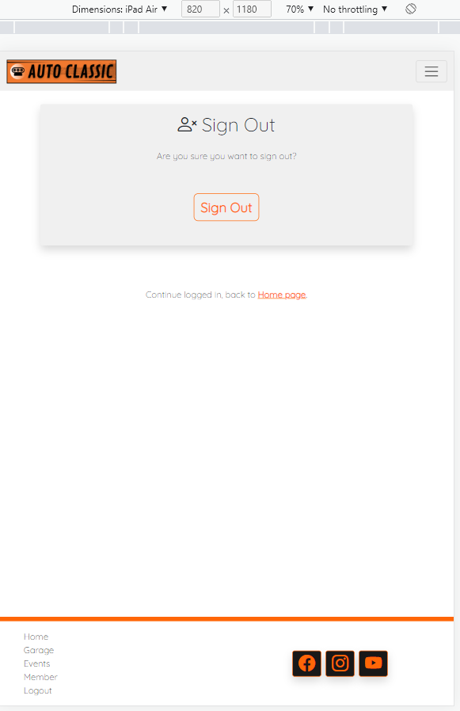

# Auto Classic - Testing

## Validation

Here is a report of the validations made on the code and their results

- __HTML__

List of pages validated by the tool [W3C Markup Validator](https://validator.w3.org/)

|   Page    |   URL  |  Result |  Link |
|    ---    |   ---  |   ---   |  ---  |
|    Home    | `https://auto-classic.herokuapp.com/` |   No errors   |  [Validated](https://validator.w3.org/nu/?doc=https%3A%2F%2Fauto-classic.herokuapp.com%2F)  |
|    Garage    | `https://auto-classic.herokuapp.com/garage/` |   No errors   |  [Validated](https://validator.w3.org/nu/?doc=https%3A%2F%2Fauto-classic.herokuapp.com%2Fgarage%2F)  |
|    Events    | `https://auto-classic.herokuapp.com/events/` |   No errors   |  [Validated](https://validator.w3.org/nu/?doc=https%3A%2F%2Fauto-classic.herokuapp.com%2Fevents%2F)  |
|    Signup    | `https://auto-classic.herokuapp.com/accounts/signup/` |   No errors   |  [Validated](https://validator.w3.org/nu/?doc=https%3A%2F%2Fauto-classic.herokuapp.com%2Faccounts%2Fsignup%2F)  |
|    Signin    | `https://auto-classic.herokuapp.com/accounts/login/` |   No errors   |  [Validated](https://validator.w3.org/nu/?doc=https%3A%2F%2Fauto-classic.herokuapp.com%2Faccounts%2Flogin%2F)  |
|    Logout    | `https://auto-classic.herokuapp.com/accounts/logout/` |   No errors   |  [Validated](https://validator.w3.org/nu/?doc=https%3A%2F%2Fauto-classic.herokuapp.com%2Faccounts%2Flogout%2F)  |
|    Member    | `https://auto-classic.herokuapp.com/members/` |   No errors   |  [Validated](https://validator.w3.org/nu/?doc=https%3A%2F%2Fauto-classic.herokuapp.com%2Fmembers%2F)  |
|    Delete Account    | `https://auto-classic.herokuapp.com/delete/` |   No errors   |  [Validated](https://validator.w3.org/nu/?doc=https%3A%2F%2Fauto-classic.herokuapp.com%2Fdelete%2F)  |
|    Member car list    | `https://auto-classic.herokuapp.com/membercars/` |   No errors   |  [Validated](https://validator.w3.org/nu/?doc=https%3A%2F%2Fauto-classic.herokuapp.com%2Fmembercars%2F)  |
|    Member event list    | `https://auto-classic.herokuapp.com/memberevents/` |   No errors   |  [Validated](https://validator.w3.org/nu/?doc=https%3A%2F%2Fauto-classic.herokuapp.com%2Fmemberevents%2F)  |
|    Add car    | `https://auto-classic.herokuapp.com/add-car/` |   No errors   |  [Validated](https://validator.w3.org/nu/?doc=https%3A%2F%2Fauto-classic.herokuapp.com%2Fadd-car%2F)  |
|    Add event    | `https://auto-classic.herokuapp.com/add-event/` |   No errors   |  [Validated](https://validator.w3.org/nu/?doc=https%3A%2F%2Fauto-classic.herokuapp.com%2Fadd-event%2F)  |
|    Edit car    | `https://auto-classic.herokuapp.com/edit-car/porsche-911-1988/` |   No errors   |  [Validated](https://validator.w3.org/nu/?doc=https%3A%2F%2Fauto-classic.herokuapp.com%2Fedit-car%2Fporsche-911-1988%2F)  |
|    Edit event    | `https://auto-classic.herokuapp.com/edit-event/road-trip-cork-to-galway/` |   No errors   |  [Validated](https://validator.w3.org/nu/?doc=https%3A%2F%2Fauto-classic.herokuapp.com%2Fedit-event%2Froad-trip-cork-to-galway%2F)  |
|    Delete car    | `https://auto-classic.herokuapp.com/delete-car/porsche-911-1988/` |   No errors   |  [Validated](https://validator.w3.org/nu/?doc=https%3A%2F%2Fauto-classic.herokuapp.com%2Fdelete-car%2Fporsche-911-1988%2F)  |
|    Delete event    | `https://auto-classic.herokuapp.com/delete-event/sale-and-trade-cars/` |   No errors   |  [Validated](https://validator.w3.org/nu/?doc=https%3A%2F%2Fauto-classic.herokuapp.com%2Fdelete-event%2Fsale-and-trade-cars%2F)  |
|    Car details    | `https://auto-classic.herokuapp.com/car-detail/chevrolet-chevelle-ss-454-1970/` |   No errors   |  [Validated](https://validator.w3.org/nu/?doc=https%3A%2F%2Fauto-classic.herokuapp.com%2Fcar-detail%2Fchevrolet-chevelle-ss-454-1970%2F)  |
|    Event details    | `https://auto-classic.herokuapp.com/event-detail/exposition-of-old-cars/` |   No errors   |  [Validated](https://validator.w3.org/nu/?doc=https%3A%2F%2Fauto-classic.herokuapp.com%2Fevent-detail%2Fexposition-of-old-cars%2F)  |
|    Rate car    | `https://auto-classic.herokuapp.com/rate-car/bugatti-eb110-gt-1993/` |   No errors   |  [Validated](https://validator.w3.org/nu/?doc=https%3A%2F%2Fauto-classic.herokuapp.com%2Frate-car%2Fbugatti-eb110-gt-1993%2F)  |

- __CSS__

List of pages validated an Unique CSS file validated by the tool [W3C Jigsaw Validator](https://jigsaw.w3.org/css-validator/)

File `/static/css/style.css` result in no error, just one alert with the following text: `-webkit-backdrop-filter is a vendor extension`

|   Page    |   URL  |  Result |  Link |
|    ---    |   ---  |   ---   |  ---  |
|    Home    | `https://auto-classic.herokuapp.com/` |   No errors   |  [Validated](https://jigsaw.w3.org/css-validator/validator?uri=https%3A%2F%2Fauto-classic.herokuapp.com%2F&profile=css3svg&usermedium=all&warning=1&vextwarning=&lang=en)  |
|    Garage    | `https://auto-classic.herokuapp.com/garage/` |   No errors   |  [Validated](https://jigsaw.w3.org/css-validator/validator?uri=https%3A%2F%2Fauto-classic.herokuapp.com%2Fgarage%2F&profile=css3svg&usermedium=all&warning=1&vextwarning=&lang=en)  |
|    Events    | `https://auto-classic.herokuapp.com/events/` |   No errors   |  [Validated](https://jigsaw.w3.org/css-validator/validator?uri=https%3A%2F%2Fauto-classic.herokuapp.com%2Fevents%2F&profile=css3svg&usermedium=all&warning=1&vextwarning=&lang=en)  |
|    Signup    | `https://auto-classic.herokuapp.com/accounts/signup/` |   No errors   |  [Validated](https://jigsaw.w3.org/css-validator/validator?uri=https%3A%2F%2Fauto-classic.herokuapp.com%2Faccounts%2Fsignup%2F&profile=css3svg&usermedium=all&warning=1&vextwarning=&lang=en)  |
|    Signin    | `https://auto-classic.herokuapp.com/accounts/login/` |   No errors   |  [Validated](https://jigsaw.w3.org/css-validator/validator?uri=https%3A%2F%2Fauto-classic.herokuapp.com%2Faccounts%2Flogin%2F&profile=css3svg&usermedium=all&warning=1&vextwarning=&lang=en)  |
|    Logout    | `https://auto-classic.herokuapp.com/accounts/logout/` |   No errors   |  [Validated](https://jigsaw.w3.org/css-validator/validator?uri=https%3A%2F%2Fauto-classic.herokuapp.com%2Faccounts%2Flogout%2F&profile=css3svg&usermedium=all&warning=1&vextwarning=&lang=en)  |
|    Member    | `https://auto-classic.herokuapp.com/members/` |   No errors   |  [Validated](https://jigsaw.w3.org/css-validator/validator?uri=https%3A%2F%2Fauto-classic.herokuapp.com%2Fmembers%2F&profile=css3svg&usermedium=all&warning=1&vextwarning=&lang=en)  |
|    Delete Account    | `https://auto-classic.herokuapp.com/delete/` |   No errors   |  [Validated](https://jigsaw.w3.org/css-validator/validator?uri=https%3A%2F%2Fauto-classic.herokuapp.com%2Fdelete%2F&profile=css3svg&usermedium=all&warning=1&vextwarning=&lang=en)  |
|    Member car list    | `https://auto-classic.herokuapp.com/membercars/` |   No errors   |  [Validated](https://jigsaw.w3.org/css-validator/validator?uri=https%3A%2F%2Fauto-classic.herokuapp.com%2Fmembercars%2F&profile=css3svg&usermedium=all&warning=1&vextwarning=&lang=en)  |
|    Member event list    | `https://auto-classic.herokuapp.com/memberevents/` |   No errors   |  [Validated](https://jigsaw.w3.org/css-validator/validator?uri=https%3A%2F%2Fauto-classic.herokuapp.com%2Fmemberevents%2F&profile=css3svg&usermedium=all&warning=1&vextwarning=&lang=en)  |
|    Add car    | `https://auto-classic.herokuapp.com/add-car/` |   No errors   |  [Validated](https://jigsaw.w3.org/css-validator/validator?uri=https%3A%2F%2Fauto-classic.herokuapp.com%2Fadd-car%2F&profile=css3svg&usermedium=all&warning=1&vextwarning=&lang=en)  |
|    Add event    | `https://auto-classic.herokuapp.com/add-event/` |   No errors   |  [Validated](https://jigsaw.w3.org/css-validator/validator?uri=https%3A%2F%2Fauto-classic.herokuapp.com%2Fadd-event%2F&profile=css3svg&usermedium=all&warning=1&vextwarning=&lang=en)  |
|    Edit car    | `https://auto-classic.herokuapp.com/edit-car/porsche-911-1988/` |   No errors   |  [Validated](https://jigsaw.w3.org/css-validator/validator?uri=https%3A%2F%2Fauto-classic.herokuapp.com%2Fedit-car%2Fporsche-911-1988%2F&profile=css3svg&usermedium=all&warning=1&vextwarning=&lang=en)  |
|    Edit event    | `https://auto-classic.herokuapp.com/edit-event/road-trip-cork-to-galway/` |   No errors   |  [Validated](https://jigsaw.w3.org/css-validator/validator?uri=https%3A%2F%2Fauto-classic.herokuapp.com%2Fedit-event%2Froad-trip-cork-to-galway%2F&profile=css3svg&usermedium=all&warning=1&vextwarning=&lang=en)  |
|    Delete car    | `https://auto-classic.herokuapp.com/delete-car/porsche-911-1988/` |   No errors   |  [Validated](https://jigsaw.w3.org/css-validator/validator?uri=https%3A%2F%2Fauto-classic.herokuapp.com%2Fdelete-car%2Fporsche-911-1988%2F&profile=css3svg&usermedium=all&warning=1&vextwarning=&lang=en)  |
|    Delete event    | `https://auto-classic.herokuapp.com/delete-event/sale-and-trade-cars/` |   No errors   |  [Validated](https://jigsaw.w3.org/css-validator/validator?uri=https%3A%2F%2Fauto-classic.herokuapp.com%2Fdelete-event%2Fsale-and-trade-cars%2F&profile=css3svg&usermedium=all&warning=1&vextwarning=&lang=en)  |
|    Car details    | `https://auto-classic.herokuapp.com/car-detail/chevrolet-chevelle-ss-454-1970/` |   No errors   |  [Validated](https://jigsaw.w3.org/css-validator/validator?uri=https%3A%2F%2Fauto-classic.herokuapp.com%2Fcar-detail%2Fchevrolet-chevelle-ss-454-1970%2F&profile=css3svg&usermedium=all&warning=1&vextwarning=&lang=en)  |
|    Event details    | `https://auto-classic.herokuapp.com/event-detail/exposition-of-old-cars/` |   No errors   |  [Validated](https://jigsaw.w3.org/css-validator/validator?uri=https%3A%2F%2Fauto-classic.herokuapp.com%2Fevent-detail%2Fexposition-of-old-cars%2F&profile=css3svg&usermedium=all&warning=1&vextwarning=&lang=en)  |
|    Rate car    | `https://auto-classic.herokuapp.com/rate-car/bugatti-eb110-gt-1993/` |   No errors   |  [Validated](https://jigsaw.w3.org/css-validator/validator?uri=https%3A%2F%2Fauto-classic.herokuapp.com%2Frate-car%2Fbugatti-eb110-gt-1993%2F&profile=css3svg&usermedium=all&warning=1&vextwarning=&lang=en)  |

- __Java Script__

List of files validated by the tool [JS Hint](https://jshint.com/)

<details>
    <summary>Java Script from base.html</summary>

```
  setTimeout(function () {
      let messages = document.getElementById('msg');
      let alert = new bootstrap.Alert(messages);
      alert.close();
  }, 3500);
```

</details> 

<details>
    <summary>Java Script from garage.html</summary>

```
    $(document).ready(function(){
        $('#load-more').on('click', function(){
            // Get data (limit and total) from button attr and total of cars displayed
            var _current_car=$(".single-car").length;
            var _limit=$(this).attr("data-limit");
            var _total=$(this).attr("data-total");

            // Get sort value from URL
            var current_url = window.location.href;
            var url_now = new URL(current_url);
            var _sort = url_now.searchParams.get("sort");

            if(_sort == null){
                    _sort = "-created_on";
                }
            
            // AJAX to send data and execute function
            $.ajax({
                url: '/load-more-cars/',
                data: {
                    limit: _limit,
                    offset: _current_car,
                    sort: _sort
                },
                dataType: 'json',
                beforeSend:function(){
                     $('#load-more').attr('disabled', true);
                },
                success:function(res){
                    $('#cars-container').append(res.car_list),
                    $('#load-more').attr('disabled', false);
                    
                    var _total_showing=$('.single-car').length;
                    if(_total_showing == _total){
                        $('#load-more').attr('hidden', true),
                        $('#load-end').attr('hidden', false);
                    }
                },
            });
        });
    });
```

</details>

<details>
    <summary>Java Script from events.html</summary>

```
    $(document).ready(function(){
        $('#load-more').on('click', function(){
            // Get data (limit and total) from button attr and total of events displayed
            var _current_event=$(".single-event").length;
            var _limit=$(this).attr("data-limit");
            var _total=$(this).attr("data-total");

            // Get sort value from URL
            var current_url = window.location.href;
            var url_now = new URL(current_url);
            var _sort = url_now.searchParams.get("sort");

            if(_sort == null){
                    _sort = "-created_on";
                }

            // AJAX to send data and execute function
            $.ajax({
                url: '/load-more-events/',
                data: {
                    limit: _limit,
                    offset: _current_event,
                    sort: _sort
                },
                dataType: 'json',
                beforeSend:function(){
                     $('#load-more').attr('disabled', true);
                },
                success:function(res){
                    $('#events-container').append(res.event_list),
                    $('#load-more').attr('disabled', false);
                    
                    var _total_showing=$('.single-event').length;
                    if(_total_showing == _total){
                        $('#load-more').attr('hidden', true),
                        $('#load-end').attr('hidden', false);
                    }
                },
            });
        });
    });
```

</details> 

|   File    |   Lines  |  Result |
|    ---    |   ---  |   ---   |
|    `base.html`    |   From 158 to 162  |   No errors   |
|    `garage.html`    |   From 90 to 130  |   No errors   |
|    `events.html`    |   From 92 to 132  |   No errors   |

- __Python__

List of pages validated by the tool [PEP8](http://pep8online.com/)

|   File    |   Result |
|    ---    |    ---   |
|    `autoclassic/asgi.py`    |   No errors   |
|    `autoclassic/settings.py`    |  5 Errors (Line to long)   |
|    `autoclassic/urls.py`    |   No errors   |
|    `autoclassic/views.py`    |   No errors   |
|    `autoclassic/wsgi.py `    |   No errors   |
|    `events/admin.py`    |   No errors   |
|    `events/apps.py`    |   No errors   |
|    `events/forms.py`    |   No errors   |
|    `events/models.py`    |   No errors   |
|    `events/urls.py `    |   No errors   |
|    `events/views.py`    |   No errors   |
|    `garage/admin.py`    |   No errors   |
|    `garage/apps.py `    |   No errors   |
|    `garage/forms.py`    |   No errors   |
|    `garage/models.py`    |   No errors   |
|    `garage/urls.py`    |   No errors   |
|    `garage/views.py`    |   No errors   |
|    `members/apps.py`    |   No errors   |
|    `members/forms.py`    |   No errors   |
|    `members/urls.py`    |   No errors   |
|    `members/views.py`    |   No errors   |
|    `general/apps.py`    |   No errors   |
|    `general/urls.py`    |   No errors   |
|    `general/views.py`    |   No errors   |

The five too long line errors found on settings were related to links from `STATICFILES_STORAGE` and `AUTH_PASSWORD_VALIDATORS`. 

## Responsiveness and Browser Compability Testing

I ran tests using DevTools to verify that the website was responsive on multiple screen sizes. On all these devices listed below the website responded properly.

   - Mobile: Iphone XR, Iphone SE, Nexus 4, Nexus 5, Moto G4, LG Optimus L70, Galaxy S8. Pixel 2, Pixel 5.

   - Tablet: Ipad Air, Ipad Mini, Galaxy Tab S4.

   - Desktop and Laptops: 13', 15' and 21'. 

<details>
    <summary>Prints from DevTolls (Chrome) - Iphone XR</summary>
    
    
    
    
    
    
    
    
    
    
    
    
    
    
    
</details> 

<details>
    <summary>Prints from DevTolls (Chrome) - Ipad Air</summary>
    
    
    
    
    
    
    
    
    
    
    
    
    
    
    
</details>

The website worked correctly in Chrome, Firefox, Edge browsers in the desktop tests. It also worked correctly in tests using Safari on the iPhone.

<details>
    <summary>Prints from Firefox and Edge browsers</summary>
    
    
    
    
    
    
    
    
    
    
    
    
    
    
    
</details>

## Performance Testing

## Acessibility Testing

## User Story Testing

## Manual Testing

### Navigation bar

|   Element    |   Action  |  Expected Result |   Outcome   |
|    ---    |   ---  |   ---   |   ---   |
|    Navbar links    |   Display  |   Show the following links for non logged in users - `Home / Garage / Events / Signup / Signin`   |   Pass   |
|    Navbar links   |   Display  |   Show the following links for logged in users - `Home / Garage / Events / Member / Logout`   |   Pass   |
|    Navbar links   |   Display  |   Automatically switch to hamburger menu on smaller screens   |   Pass   |
|    Navbar links   |   Hover  |   Hover effect on links when mouseover or clicked (mobile)   |   Pass   |
|    Logo banner (image)    |   Click  |   Redirect to the homepage   |   Pass   |
|    Home link    |   Click  |   Redirect to the homepage   |   Pass   |
|    Garage link    |   Click  |   Redirect to the Garage page (All cars)   |   Pass   |
|    Events link    |   Click  |   Redirect to the Events page (All events)   |   Pass   |
|    Signup link    |   Click  |   Redirect to the Signup page (Register)   |   Pass   |
|    Signin link    |   Click  |   Redirect to the Signin page (Login)   |   Pass   |
|    Logout link    |   Click  |   If user logged in. Redirect to the Signout page (Logout)   |   Pass   |
|    Member link    |   Click  |   If user logged in. Redirect to the Member area page   |   Pass   |

### Footer

|   Element    |   Action  |  Expected Result |   Outcome   |
|    ---    |   ---  |   ---   |   ---   |
|    Footer links    |   Display  |   Show the following links for non logged in users - `Home / Garage / Events / Signup / Signin`   |   Pass   |
|    Footer links    |   Display  |   Show the following links for logged in users - `Home / Garage / Events / Member / Logout`   |   Pass   |
|    Footer links    |   Display  |   Hover effect on links when mouseover or clicked (mobile)   |   Pass   |
|    Footer social links    |   Display  |   Show the following social links for all users - `Facebook icon / Instagram icon / Youtube icon`   |   Pass   |
|    Footer social links    |   Hover  |   Hover effect on links when mouseover or clicked (mobile)   |   Pass   |
|    Home link    |   Click  |   Redirect to the homepage   |   Pass   |
|    Garage link    |   Click  |   Redirect to the Garage page (All cars)   |   Pass   |
|    Events link    |   Click  |   Redirect to the Events page (All events)   |   Pass   |
|    Signup link    |   Click  |   Redirect to the Signup page (Register)   |   Pass   |
|    Signin link    |   Click  |   Redirect to the Signin page (Login)   |   Pass   |
|    Logout link    |   Click  |   If user logged in. Redirect to the Signout page (Logout)   |   Pass   |
|    Member link    |   Click  |   If user logged in. Redirect to the Member area page   |   Pass   |
|    Facebook social link    |   Click  |   Open the Facebook web page in a new tab   |   Pass   |
|    Instagram social link    |   Click  |   Open the Instagram web page in a new tab   |   Pass   |
|    Youtube social link    |   Click  |   Open the Youtube web page in a new tab   |   Pass   |

### Home page

|   Element    |   Action  |  Expected Result |   Outcome   |
|    ---    |   ---  |   ---   |   ---   |
|    Latest Cars (Garage)    |   Display  |   Show only the last 4 cars added to the website    |   Pass   |
|    Latest Cars (Garage)    |   Display  |   Display a button `Explore` after the car cards   |   Pass   |
|    Explore button (Garage)    |   Hover  |   Hover effect on button when mouseover or clicked (mobile)    |   Pass   |
|    Explore button (Garage)    |   Click  |    Redirect to the Garage page (All cars)    |   Pass   |
|    Car card (Garage)    |   Display  |   Display the following information of each car - `Image, model, brand, year, created by and number of favourites`   |   Pass   |
|    Car card (Garage)    |   Display  |   Display a button `View more` inside car cards   |   Pass   |
|    View more button (Garage - Car card)    |   Hover  |   Hover effect on button when mouseover or clicked (mobile)    |   Pass   |
|    View more button (Garage - Car card)    |   Click  |    Redirect to the Car details page    |   Pass   |
|    Latest Events (Events)    |   Display  |   Show only the last 4 events added to the website    |   Pass   |
|    Latest Events (Events)    |   Display  |   Display a button `Check out` after the events cards   |   Pass   |
|    Check out button (Events)    |   Hover  |   Hover effect on button when mouseover or clicked (mobile)    |   Pass   |
|    Check out button (Events)    |   Click  |    Redirect to the Events page (All events)    |   Pass   |
|    Event card (Events)    |   Display  |   Display the following information of each event - `Image, title, category, local, date and number of presence votes`   |   Pass   |
|    Event card (Events)    |   Display  |   Display a button `View more` inside event cards   |   Pass   |
|    View more button (Events - Event card)    |   Hover  |   Hover effect on button when mouseover or clicked (mobile)    |   Pass   |
|    View more button (Events - Event card)    |   Click  |    Redirect to the Event details page    |   Pass   |
|    Final section (Join Us / Hello)    |   Display  |    If user not logged in. Display  `Join us` title and text calling for registration    |   Pass   |
|    Final section (Join Us / Hello)    |   Display  |    If user logged in. Display  `Hello, "username"` title and text calling the user to access your area   |   Pass   |
|    Final section (Join Us / Hello)    |   Display  |    If user not logged in. Display  `Register` button    |   Pass   |
|    Final section (Join Us / Hello)    |   Display  |    If user logged in. Display  `Your area` button    |   Pass   |
|    Register button    |   Hover  |    Hover effect on button when mouseover or clicked (mobile)    |   Pass   |
|    Register button    |   Click  |    Redirect to the Signup page (Register)    |   Pass   |
|    Your area button    |   Hover  |    Hover effect on button when mouseover or clicked (mobile)    |   Pass   |
|    Your area button    |   Click  |    Redirect to the Member area page    |   Pass   |

### Accounts pages 

- __Signup__

|   Element    |   Action  |  Expected Result |   Outcome   |
|    ---    |   ---  |   ---   |   ---   |
|    Signup page    |   Display  |   Display the following fields inside the form - `Username, E-mail (optional), Password, Password (again)`   |   Pass   |
|    Signup page    |   Display  |   Display  `Signup` button   |   Pass   |
|    Signup page    |   Display  |   Show calling text for those who are already registered and `Signin` button  |   Pass   |
|    Signup form    |   Field Username: empty  |   Submitting: Form not submitted. Warning message  |   Pass   |
|    Signup form    |   Field Username: duplicated  |   Submitting: Form not submitted. Warning message  |   Pass   |
|    Signup form    |   Field Username: incorrect format  |   Submitting: Form not submitted. Warning message  |   Pass   |
|    Signup form    |   Field Username: correct format  |   Submitting: Form submitted. Success message  |   Pass   |
|    Signup form    |   Field E-mail: empty  |   Submitting: Form submitted. Success message |   Pass   |
|    Signup form    |   Field E-mail: duplicated  |   Submitting: Form not submitted. Warning message |   Pass   |
|    Signup form    |   Field E-mail: incorrect format  |   Submitting: Form not submitted. Warning message |   Pass   |
|    Signup form    |   Field E-mail: correct format  |   Submitting: Form submitted. Success message |   Pass   |
|    Signup form    |   Field Password: empty  |   Submitting: Form not submitted. Warning message  |   Pass   |
|    Signup form    |   Field Password: incorrect format  |   Submitting: Form not submitted. Warning message  |   Pass   |
|    Signup form    |   Field Password: correct format  |   Submitting: Form submitted. Success message  |   Pass   |
|    Signup form    |   Field Password (again): empty  |   Submitting: Form not submitted. Warning message |   Pass   |
|    Signup form    |   Field Password (again): incorrect format  |   Submitting: Form not submitted. Warning message |   Pass   |
|    Signup form    |   Field Password (again): correct format |   Submitting: Form submitted. Success message |   Pass   |
|    Signup form    |   Fields Password + Password (again): don't match |   Submitting: Form not submitted. Warning message |   Pass   |
|    Signup form    |   Fields Password + Password (again): match |   Submitting: Form submitted. Success message |   Pass   |
|    Signup button    |   Hover  |   Hover effect on button when mouseover or clicked (mobile)   |   Pass   |
|    Signin button    |   Hover  |   Hover effect on button when mouseover or clicked (mobile)   |   Pass   |
|    Signup button    |   Click  |   If form valid - Adds new user, redirects to home page, shows success message    |   Pass   |
|    Signin button    |   Click  |   Redirect to the Signin page (Login)    |   Pass   |

- __Signin__

|   Element    |   Action  |  Expected Result |   Outcome   |
|    ---    |   ---  |   ---   |   ---   |
|    Signin page    |   Display  |   Display the following fields inside the form - `Username, Password`   |   Pass   |
|    Signin page    |   Display  |   Display  `Signin` button   |   Pass   |
|    Signin page    |   Display  |   Show calling text for those who aren't registered and `Signup` button  |   Pass   |
|    Signin form    |   Field Username: empty  |   Submitting: Form not submitted. Warning message  |   Pass   |
|    Signin form    |   Field Username: wrong username  |   Submitting: Form not submitted. Warning message  |   Pass   |
|    Signin form    |   Field Username: correct username  |   Submitting: Form submitted. Success message  |   Pass   |
|    Signin form    |   Field Password: empty  |   Submitting: Form not submitted. Warning message  |   Pass   |
|    Signin form    |   Field Password: wrong password  |   Submitting: Form not submitted. Warning message  |   Pass   |
|    Signin form    |   Field Password: correct password  |   Submitting: Form submitted. Success message  |   Pass   |
|    Signin button    |   Hover  |   Hover effect on button when mouseover or clicked (mobile)   |   Pass   |
|    Signup button    |   Hover  |   Hover effect on button when mouseover or clicked (mobile)   |   Pass   |
|    Signin button    |   Click  |   If form valid - User authenticated login, redirects to home page, shows success message    |   Pass   |
|    Signup button    |   Click  |   Redirect to the Signup page (Register)    |   Pass   |

- __Logout__

|   Element    |   Action  |  Expected Result |   Outcome   |
|    ---    |   ---  |   ---   |   ---   |
|    Logout page    |   Display  |   Display the following text inside the form - `Are you sure you want to sign out?`   |   Pass   |
|    Logout page    |   Display  |   Display  `Signout` button   |   Pass   |
|    Logout page    |   Display  |   Show calling text to user continue in the website and `Home page` button  |   Pass   |
|    Signout button    |   Hover  |   Hover effect on button when mouseover or clicked (mobile)   |   Pass   |
|    Home page button    |   Hover  |   Hover effect on button when mouseover or clicked (mobile)   |   Pass   |
|    Signout button    |   Click  |   Logout the user, redirects to home page, shows success message    |   Pass   |
|    Home page button    |   Click  |   Redirect to the Home page    |   Pass   |

- __Delete account__

|   Element    |   Action  |  Expected Result |   Outcome   |
|    ---    |   ---  |   ---   |   ---   |
|    Delete account page    |   Display  |   Display a text asking if he really wants to go ahead with this action   |   Pass   |
|    Delete account page    |   Display  |   Display  `Delete` and `Cancel` button   |   Pass   |
|    Delete account page    |   Display  |   Show calling text to user back to user page and `Member` button  |   Pass   |
|    Delete button    |   Hover  |   Hover effect on button when mouseover or clicked (mobile)   |   Pass   |
|    Cancel button    |   Hover  |   Hover effect on button when mouseover or clicked (mobile)   |   Pass   |
|    Member area button    |   Hover  |   Hover effect on button when mouseover or clicked (mobile)   |   Pass   |
|    Delete button    |   Click  |   Delete user account, redirects to home page, shows success message   |   Pass   |
|    Cancel button    |   Click  |   Redirect to the Home page   |   Pass   |
|    Member area button    |   Click  |   Redirect to the Member page   |   Pass   |

### Garage page

|   Element    |   Action  |  Expected Result |   Outcome   |
|    ---    |   ---  |   ---   |   ---   |
|    Garage page    |   Display  |   Show the last 6 cars added to the website    |   Pass   |
|    Garage page    |   Display  |   Display a sort options  |   Pass   |
|    Garage page    |   Display  |   Display a search bar  |   Pass   |
|    Garage page    |   Display  |   Display a button `Load more` after the car cards   |   Pass   |
|    Car card (Garage)    |   Display  |   Display the following information of each car - `Image, model, brand, year, created by and number of favourites`   |   Pass   |
|    Car card (Garage)    |   Display  |   Display a button `View more` inside car cards   |   Pass   |
|    View more button (Garage - Car card)    |   Hover  |   Hover effect on button when mouseover or clicked (mobile)    |   Pass   |
|    View more button (Garage - Car card)    |   Click  |    Redirect to the Car details page    |   Pass   |
|    Sort options    |   Click  |   Display a list with 6 order options and their descriptions  |   Pass   |
|    Sort options    |   Select  |   Reloads the page and shows 6 cars in the selected order, and `Load more` button  |   Pass   |
|    Sort options    |   Select  |   All 6 options answering the order according to the description  |   Pass   |
|    Search bar    |   Click  |   Opens the option to enter the text you wish to search for  |   Pass   |
|    Search bar (search icon)   |   Click  |   Redirect to a new search page with the results of the serach  |   Pass   |
|    Search bar (cross icon)   |   Click  |   Clear the search bar and redirect to original Garage page  |   Pass   |
|    Load more button    |   Click  |    Load more 3 cars cards and display after the last one in the correct order    |   Pass   |
|    Load more button    |   Display  |    If all cars have been loaded, the button changes to `No more cars`     |   Pass   |

### Events page

|   Element    |   Action  |  Expected Result |   Outcome   |
|    ---    |   ---  |   ---   |   ---   |
|    Events page    |   Display  |   Show the last 6 events added to the website    |   Pass   |
|    Events page    |   Display  |   Display a sort options  |   Pass   |
|    Events page    |   Display  |   Display a search bar  |   Pass   |
|    Events page    |   Display  |   Display a button `Load more` after the events cards   |   Pass   |
|    Event card (Events)    |   Display  |   Display the following information of each event - `Image, title, category, local, date and number of presence votes`   |   Pass   |
|    Event card (Events)    |   Display  |   Display a button `View more` inside event cards   |   Pass   |
|    View more button (Events - Event card)    |   Hover  |   Hover effect on button when mouseover or clicked (mobile)    |   Pass   |
|    View more button (Events - Event card)    |   Click  |    Redirect to the Event details page    |   Pass   |
|    Sort options    |   Click  |   Display a list with 6 order options and their descriptions  |   Pass   |
|    Sort options    |   Select  |   Reloads the page and shows 6 events in the selected order, and `Load more` button  |   Pass   |
|    Sort options    |   Select  |   All 6 options answering the order according to the description  |   Pass   |
|    Search bar    |   Click  |   Opens the option to enter the text you wish to search for  |   Pass   |
|    Search bar (search icon)   |   Click  |   Redirect to a new search page with the results of the serach  |   Pass   |
|    Search bar (cross icon)   |   Click  |   Clear the search bar and redirect to original Events page  |   Pass   |
|    Load more button    |   Click  |    Load more 3 events cards and display after the last one in the correct order    |   Pass   |
|    Load more button    |   Display  |    If all cars have been loaded, the button changes to `No more events`     |   Pass   |

### Car detail page

|   Element    |   Action  |  Expected Result |   Outcome   |
|    ---    |   ---  |   ---   |   ---   |
|    Car detail page    |   Display  |   Display the following contents: `Car image + favourite / Car details / Rate section / Comment section`   |   Pass   |
|    Car detail page    |   Permission  |   All users. Cas see the total of favourites, all rate reviews, all approved comments   |   Pass   |
|    Car detail page    |   Permission  |   If user not logged in. No interaction with favourite button   |   Pass   |
|    Car detail page    |   Permission  |   If user not logged in. Does not allow comments   |   Pass   |
|    Car detail page    |   Permission  |   If user not logged in. Does not allow rate a car   |   Pass   |
|    Car detail page    |   Permission  |   If user logged in. User can favourite and unfavourite the car   |   Pass   |
|    Car detail page    |   Permission  |   If user logged in. User can send a comment for approval   |   Pass   |
|    Car detail page    |   Permission  |   If user logged in. User can access the form to evaluate the car, once only  |   Pass   |
|    Favourite button (Autheticated user)   |   Click  |   If not clicked, it adds one more vote to the total and changes the star icon. If already clicked, subtracts one vote from the total and returns to the original icon  |   Pass   |
|    All rate reviews button (All users)   |   Hover  |   Hover effect on button when mouseover or clicked (mobile)  |   Pass   |
|    All rate reviews button (All users)   |   Click  |   If not clicked, open a list with all users reviews votes. If already clicked, close de list with all reviews  |   Pass   |
|    Rate this car button (Autheticated user)   |   Hover  |   Hover effect on button when mouseover or clicked (mobile)   |   Pass   |
|    Rate this car button (Autheticated user)   |   Click  |   Redirect the user to the Rate car page, with review form   |   Pass   |
|    Comment text field (Autheticated user)   |   Display  |   A text field to insert the comment and a `Submit` button   |   Pass   |
|    Comment text field (Autheticated user)   |   Field Username: empty  |  Submitting: Form not submitted. Warning message    |   Pass   |
|    Comment text field (Autheticated user)   |   Field Username: corret format  |  Submitting: Form submitted. Success message (Waiting aprrove)    |   Pass   |
|    Submit button - Comment (Autheticated user)   |   Hover  |  Hover effect on button when mouseover or clicked (mobile)    |   Pass   |
|    Submit button - Comment (Autheticated user)   |   Click  |  Submitting (valid form): Form submitted. Success message (Waiting aprrove)    |   Pass   |

### Rate Car review page

|   Element    |   Action  |  Expected Result |   Outcome   |
|    ---    |   ---  |   ---   |   ---   |
|    Rate car page    |   Display  |   If rated. Display basic car informations, message informing that user already voted for this car, and button `car details`   |   Pass   |
|    Rate car page    |   Display  |   If not rated. Display basic car informations, car image, rate review form   |   Pass   |
|    Rate car form    |   Display  |   If not rated. Display the current user name, five fields for vote, `Submit` and `Go back` buttons    |   Pass   |
|    Rate car form    |   Display  |   Field load with score 5 for default    |   Pass   |
|    Rate car form    |   Fields select  |   User can select five numbers, from 1 to 5 for each field.   |   Pass   |
|    Submit button    |   Click  |   Form submitted. Success message, display button `car details`   |   Pass   |
|    Go back button    |   Click  |   Redirect to the previus car details page   |   Pass   |
|    Car details button  (If submited)  |   Click  |   Redirect to the previus car details page   |   Pass   |

### Event detail page

|   Element    |   Action  |  Expected Result |   Outcome   |
|    ---    |   ---  |   ---   |   ---   |
|    Event detail page    |   Display  |   Display the following contents: `Event image + presence / Event details / Comment section`   |   Pass   |
|    Event detail page    |   Permission  |   All users. Cas see the total of presence votes, all approved comments   |   Pass   |
|    Event detail page    |   Permission  |   If user not logged in. No interaction with presence buttons   |   Pass   |
|    Event detail page    |   Permission  |   If user not logged in. Does not allow comments   |   Pass   |
|    Event detail page    |   Permission  |   If user logged in. User can confirme presence (Go or Maybe) for the event   |   Pass   |
|    Event detail page    |   Permission  |   If user logged in. User can send a comment for approval   |   Pass   |
|    Go button (Autheticated user)   |   Click  |   If not clicked, it adds one more vote to the total and changes the check calendar icon. If already clicked, subtracts one vote from the total and returns to the original icon  |   Pass   |
|    Maybe button (Autheticated user)   |   Click  |   If not clicked, it adds one more vote to the total and changes the empty calendar icon. If already clicked, subtracts one vote from the total and returns to the original icon  |   Pass   |
|    Go button (Autheticated user)   |   Click  |   If the Maybe button has already been selected, it will be deselected and the vote will be transferred to the Go total   |   Pass   |
|    Maybe button (Autheticated user)   |   Click  |   If the Go button has already been selected, it will be deselected and the vote will be transferred to the Maybe total   |   Pass   |
|    Comment text field (Autheticated user)   |   Display  |   A text field to insert the comment and a `Submit` button   |   Pass   |
|    Comment text field (Autheticated user)   |   Field Username: empty  |  Submitting: Form not submitted. Warning message    |   Pass   |
|    Comment text field (Autheticated user)   |   Field Username: corret format  |  Submitting: Form submitted. Success message (Waiting aprrove)    |   Pass   |
|    Submit button - Comment (Autheticated user)   |   Hover  |  Hover effect on button when mouseover or clicked (mobile)    |   Pass   |
|    Submit button - Comment (Autheticated user)   |   Click  |  Submitting (valid form): Form submitted. Success message (Waiting aprrove)    |   Pass   |

### Member page

|   Element    |   Action  |  Expected Result |   Outcome   |
|    ---    |   ---  |   ---   |   ---   |
|    Member page    |   Display  |   Display five buttons: `Add new car`, `Add new event`, `My cars`, `My events`, `Delete account`   |   Pass   |
|    Member page    |   Permission  |   If user not logged in. Shows a text for creating an account or logging in and the respective buttons with links   |   Pass   |
|   Add new car button    |   Hover  |  Hover effect on button when mouseover or clicked (mobile)    |   Pass   |
|   Add new event button   |   Hover  |  Hover effect on button when mouseover or clicked (mobile)    |   Pass   |
|   My cars button   |   Hover  |  Hover effect on button when mouseover or clicked (mobile)    |   Pass   |
|   My events button   |   Hover  |  Hover effect on button when mouseover or clicked (mobile)    |   Pass   |
|   Delete account car button   |   Hover  |  Hover effect on button when mouseover or clicked (mobile)    |   Pass   |
|   Add new car button    |   Click  |  Redirect to add car page    |   Pass   |
|   Add new event button   |   Click  |  Redirect to add event page    |   Pass   |
|   My cars button   |   Click  |  Redirect to member cars page    |   Pass   |
|   My events button   |   Click  |  Redirect to member events page    |   Pass   |
|   Delete account car button   |   Click  |  Redirect to member delete account page    |   Pass   |

### Member car list page

|   Element    |   Action  |  Expected Result |   Outcome   |
|    ---    |   ---  |   ---   |   ---   |
|    Member cars page    |   Display  |   Display a button `Member area`, a list with all the cars added by the user, for each car a button `View`, `Edit`, `Delete` |   Pass   |
|    Member area button    |   Hover  |   Hover effect on button when mouseover or clicked (mobile) |   Pass   |
|    View button    |   Hover  |   Hover effect on button when mouseover or clicked (mobile) |   Pass   |
|    Edit button    |   Hover  |   Hover effect on button when mouseover or clicked (mobile) |   Pass   |
|    Delete button    |   Hover  |   Hover effect on button when mouseover or clicked (mobile) |   Pass   |
|    Member area button    |   Click  |    Redirect to member area page |   Pass   |
|    View button    |   Click  |   Redirect to car details page |   Pass   |
|    Edit button    |   Click  |   Redirect to edit car page |   Pass   |
|    Delete button    |   Click  |   Redirect to delete car page |   Pass   |

### Member event list page

|   Element    |   Action  |  Expected Result |   Outcome   |
|    ---    |   ---  |   ---   |   ---   |
|    Member events page    |   Display  |   Display a button `Member area`, a list with all the events added by the user, for each event a button `View`, `Edit`, `Delete` |   Pass   |
|    Member area button    |   Hover  |   Hover effect on button when mouseover or clicked (mobile) |   Pass   |
|    View button    |   Hover  |   Hover effect on button when mouseover or clicked (mobile) |   Pass   |
|    Edit button    |   Hover  |   Hover effect on button when mouseover or clicked (mobile) |   Pass   |
|    Delete button    |   Hover  |   Hover effect on button when mouseover or clicked (mobile) |   Pass   |
|    Member area button    |   Click  |    Redirect to member area page |   Pass   |
|    View button    |   Click  |   Redirect to event details page |   Pass   |
|    Edit button    |   Click  |   Redirect to edit event page |   Pass   |
|    Delete button    |   Click  |   Redirect to delete event page |   Pass   |

### Add car page

|   Element    |   Action  |  Expected Result |   Outcome   |
|    ---    |   ---  |   ---   |   ---   |
|    Add car page    |  Display  |   Display add new car form, `Submit` and `Cancel` buttons    |   Pass   |
|    Add car form    |  Display  |   Display the following fields: `Brand, Model, Year, Price, Hp, Speed, Description, Image"    |   Pass   |
|    Add car form    |  Field Brand: empty  |   Submitting: Form not submitted. Warning message   |   Pass   |
|    Add car form    |  Field Brand: incorrect format  |  Submitting: Form not submitted. Warning message    |   Pass   |
|    Add car form    |  Field Brand: correct format  |  Submitting: Form submitted. Success message    |   Pass   |
|    Add car form    |  Field Model: empty  |   Submitting: Form not submitted. Warning message   |   Pass   |
|    Add car form    |  Field Model: incorrect format  |  Submitting: Form not submitted. Warning message    |   Pass   |
|    Add car form    |  Field Model: correct format  |  Submitting: Form submitted. Success message    |   Pass   |
|    Add car form    |  Field Year: empty  |   Submitting: Form not submitted. Warning message   |   Pass   |
|    Add car form    |  Field Year: incorrect format  |  Submitting: Form not submitted. Warning message    |   Pass   |
|    Add car form    |  Field Year: correct format  |  Submitting: Form submitted. Success message    |   Pass   |
|    Add car form    |  Field Price: empty  |   Submitting: Form not submitted. Warning message   |   Pass   |
|    Add car form    |  Field Price: incorrect format  |  Submitting: Form not submitted. Warning message    |   Pass   |
|    Add car form    |  Field Price: correct format  |  Submitting: Form submitted. Success message    |   Pass   |
|    Add car form    |  Field HP: empty  |   Submitting: Form not submitted. Warning message   |   Pass   |
|    Add car form    |  Field HP: incorrect format  |  Submitting: Form not submitted. Warning message    |   Pass   |
|    Add car form    |  Field HP: correct format  |  Submitting: Form submitted. Success message    |   Pass   |
|    Add car form    |  Field Speed: empty  |   Submitting: Form not submitted. Warning message   |   Pass   |
|    Add car form    |  Field Speed: incorrect format  |  Submitting: Form not submitted. Warning message    |   Pass   |
|    Add car form    |  Field Speed: correct format  |  Submitting: Form submitted. Success message    |   Pass   |
|    Add car form    |  Field Description: empty  |   Submitting: Form not submitted. Warning message   |   Pass   |
|    Add car form    |  Field Description: correct format  |  Submitting: Form submitted. Success message    |   Pass   |
|    Add car form    |  Field Image: empty  |   Submitting: Form submitted, add placeholder image. Success message   |   Pass   |
|    Add car form    |  Field Image: uploaded  |  Submitting: Form submitted. Success message    |   Pass   |
|    Submit button    |   Click  |   Form submitted. Success message, redirect to member page   |   Pass   |
|    Cancel button    |   Click  |   Redirect to the member page   |   Pass   |

### Add event page

|   Element    |   Action  |  Expected Result |   Outcome   |
|    ---    |   ---  |   ---   |   ---   |
|    Add event page    |  Display  |   Display add new event form, `Submit` and `Cancel` buttons    |   Pass   |
|    Add event form    |  Display  |   Display the following fields: `Event title, Category, Start date, Start time, Local, Description, Image"    |   Pass   |
|    Add event form    |  Field Event title: empty  |   Submitting: Form not submitted. Warning message   |   Pass   |
|    Add event form    |  Field Event title: incorrect format  |  Submitting: Form not submitted. Warning message    |   Pass   |
|    Add event form    |  Field Event title: correct format  |  Submitting: Form submitted. Success message    |   Pass   |
|    Add event form    |  Field Event Category: not selected  |   Submitting: Form submitted. Success message, Set category as default: `Other Events`     |   Pass   |
|    Add event form    |  Field Event Category: selected  |  Submitting: Form submitted. Success message     |   Pass   |
|    Add event form    |  Field Start Date: empty  |   Submitting: Form not submitted. Warning message   |   Pass   |
|    Add event form    |  Field Start Date: correct format  |  Submitting: Form submitted. Success message     |   Pass   |
|    Add event form    |  Field Start Time: empty  |   Submitting: Form not submitted. Warning message   |   Pass   |
|    Add event form    |  Field Start Time: correct format  |  Submitting: Form submitted. Success message     |   Pass   |
|    Add event form    |  Field Local: empty  |   Submitting: Form not submitted. Warning message   |   Pass   |
|    Add event form    |  Field Local: incorrect format  |  Submitting: Form not submitted. Warning message    |   Pass   |
|    Add event form    |  Field Local: correct format  |  Submitting: Form submitted. Success message    |   Pass   |
|    Add event form    |  Field Description: empty  |   Submitting: Form not submitted. Warning message   |   Pass   |
|    Add event form    |  Field Description: correct format  |  Submitting: Form submitted. Success message    |   Pass   |
|    Add event form    |  Field Image: empty  |   Submitting: Form submitted, add placeholder image. Success message   |   Pass   |
|    Add event form    |  Field Image: uploaded  |  Submitting: Form submitted. Success message    |   Pass   |
|    Submit button    |   Click  |   Form submitted. Success message, redirect to member page   |   Pass   |
|    Cancel button    |   Click  |   Redirect to the member page   |   Pass   |

### Edit car page

|   Element    |   Action  |  Expected Result |   Outcome   |
|    ---    |   ---  |   ---   |   ---   |
|    Edit car page    |  Display  |   Display edit car form, `Submit` and `Cancel` buttons    |   Pass   |
|    Edit car form    |  Display  |   Display the following fields with previews saved data: `Brand, Model, Year, Price, Hp, Speed, Description, Image"    |   Pass   |
|    Edit car page    |   Permission  |   If the user is not the one who created the post, access to the page is denied   |   Pass   |
|    Edit car form    |  Field Edited Brand: empty  |   Submitting: Form not submitted. Warning message   |   Pass   |
|    Edit car form    |  Field Edited Brand: incorrect format  |  Submitting: Form not submitted. Warning message    |   Pass   |
|    Edit car form    |  Field Edited Brand: correct format  |  Submitting: Form submitted. Success message    |   Pass   |
|    Edit car form    |  Field Edited Model: empty  |   Submitting: Form not submitted. Warning message   |   Pass   |
|    Edit car form    |  Field Edited Model: incorrect format  |  Submitting: Form not submitted. Warning message    |   Pass   |
|    Edit car form    |  Field Edited Model: correct format  |  Submitting: Form submitted. Success message    |   Pass   |
|    Edit car form    |  Field Edited Year: empty  |   Submitting: Form not submitted. Warning message   |   Pass   |
|    Edit car form    |  Field Edited Year: incorrect format  |  Submitting: Form not submitted. Warning message    |   Pass   |
|    Edit car form    |  Field Edited Year: correct format  |  Submitting: Form submitted. Success message    |   Pass   |
|    Edit car form    |  Field Edited Price: empty  |   Submitting: Form not submitted. Warning message   |   Pass   |
|    Edit car form    |  Field Edited Price: incorrect format  |  Submitting: Form not submitted. Warning message    |   Pass   |
|    Edit car form    |  Field Edited Price: correct format  |  Submitting: Form submitted. Success message    |   Pass   |
|    Edit car form    |  Field Edited HP: empty  |   Submitting: Form not submitted. Warning message   |   Pass   |
|    Edit car form    |  Field Edited HP: incorrect format  |  Submitting: Form not submitted. Warning message    |   Pass   |
|    Edit car form    |  Field Edited HP: correct format  |  Submitting: Form submitted. Success message    |   Pass   |
|    Edit car form    |  Field Edited Speed: empty  |   Submitting: Form not submitted. Warning message   |   Pass   |
|    Edit car form    |  Field Edited Speed: incorrect format  |  Submitting: Form not submitted. Warning message    |   Pass   |
|    Edit car form    |  Field Edited Speed: correct format  |  Submitting: Form submitted. Success message    |   Pass   |
|    Edit car form    |  Field Edited Description: empty  |   Submitting: Form not submitted. Warning message   |   Pass   |
|    Edit car form    |  Field Edited Description: correct format  |  Submitting: Form submitted. Success message    |   Pass   |
|    Edit car form    |  Field Edited Image: empty  |   Submitting: Form submitted, add placeholder image. Success message   |   Pass   |
|    Edit car form    |  Field Edited Image: uploaded  |  Submitting: Form submitted. Success message    |   Pass   |
|    Submit button    |   Click  |   Form submitted. Success message, redirect to member page   |   Pass   |
|    Cancel button    |   Click  |   Redirect to the member page   |   Pass   |

### Edit event page

|   Element    |   Action  |  Expected Result |   Outcome   |
|    ---    |   ---  |   ---   |   ---   |
|    Edit event page    |  Display  |   Display edit event form, `Submit` and `Cancel` buttons    |   Pass   |
|    Edit event form    |  Display  |   Display the following fields with previews saved data: `Event title, Category, Start date, Start time, Local, Description, Image"    |   Pass   |
|    Edit event page    |   Permission  |   If the user is not the one who created the post, access to the page is denied   |   Pass   |
|    Edit event form    |  Field Edited Event title: empty  |   Submitting: Form not submitted. Warning message   |   Pass   |
|    Edit event form    |  Field Edited Event title: incorrect format  |  Submitting: Form not submitted. Warning message    |   Pass   |
|    Edit event form    |  Field Edited Event title: correct format  |  Submitting: Form submitted. Success message    |   Pass   |
|    Edit event form    |  Field Event Category: not change select  |  Submitting: Form submitted. Success message     |   Pass   |
|    Edit event form    |  Field Edited Event Category: change select  |  Submitting: Form submitted. Success message     |   Pass   |
|    Edit event form    |  Field Edited Start Date: empty  |   Submitting: Form not submitted. Warning message   |   Pass   |
|    Edit event form    |  Field Edited Start Date: correct format  |  Submitting: Form submitted. Success message     |   Pass   |
|    Edit event form    |  Field Edited Start Time: empty  |   Submitting: Form not submitted. Warning message   |   Pass   |
|    Edit event form    |  Field Edited Start Time: correct format  |  Submitting: Form submitted. Success message     |   Pass   |
|    Edit event form    |  Field Edited Local: empty  |   Submitting: Form not submitted. Warning message   |   Pass   |
|    Edit event form    |  Field Edited Local: incorrect format  |  Submitting: Form not submitted. Warning message    |   Pass   |
|    Edit event form    |  Field Edited Local: correct format  |  Submitting: Form submitted. Success message    |   Pass   |
|    Edit event form    |  Field Edited Description: empty  |   Submitting: Form not submitted. Warning message   |   Pass   |
|    Edit event form    |  Field Edited Description: correct format  |  Submitting: Form submitted. Success message    |   Pass   |
|    Edit event form    |  Field Edited Image: empty  |   Submitting: Form submitted, add placeholder image. Success message   |   Pass   |
|    Edit event form    |  Field Edited Image: uploaded  |  Submitting: Form submitted. Success message    |   Pass   |
|    Submit button    |   Click  |   Form submitted. Success message, redirect to member page   |   Pass   |
|    Cancel button    |   Click  |   Redirect to the member page   |   Pass   |

### Delete car page

|   Element    |   Action  |  Expected Result |   Outcome   |
|    ---    |   ---  |   ---   |   ---   |
|    Delete car page    |   Display  |   Display car basic information, car image, a text asking if he really wants to go ahead with this action   |   Pass   |
|    Delete car page    |   Display  |   Display  `Delete` and `Go back` button   |   Pass   |
|    Depete car page    |   Permission  |   If the user is not the one who created the post, access to the page is denied   |   Pass   |
|    Delete button    |   Hover  |   Hover effect on button when mouseover or clicked (mobile)   |   Pass   |
|    Go back button    |   Hover  |   Hover effect on button when mouseover or clicked (mobile)   |   Pass   |
|    Delete button    |   Click  |   Delete user car post, redirect to member page, shows success message   |   Pass   |
|    Go back button    |   Click  |   Redirect to the member cars list page   |   Pass   |

### Delete event page

|   Element    |   Action  |  Expected Result |   Outcome   |
|    ---    |   ---  |   ---   |   ---   |
|    Delete event page    |   Display  |   Display event basic information, event image, a text asking if he really wants to go ahead with this action   |   Pass   |
|    Delete event page    |   Display  |   Display  `Delete` and `Go back` button   |   Pass   |
|    Delete event page    |   Permission  |   If the user is not the one who created the post, access to the page is denied   |   Pass   |
|    Delete button    |   Hover  |   Hover effect on button when mouseover or clicked (mobile)   |   Pass   |
|    Go back button    |   Hover  |   Hover effect on button when mouseover or clicked (mobile)   |   Pass   |
|    Delete button    |   Click  |   Delete user car post, redirect to member page, shows success message   |   Pass   |
|    Go back button    |   Click  |   Redirect to the member event list page   |   Pass   |
